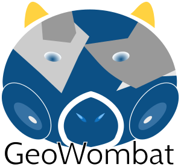

[](https://lbesson.mit-license.org/)
[](https://www.python.org/downloads/release/python-360/)


### *GeoWombat* is a Python package for geo-utilities applied to air- and space-borne imagery

Like a wombat, [`GeoWombat`](https://github.com/jgrss/geowombat) has a simple interface with a strong backend. GeoWombat uses
[`Rasterio`](https://github.com/mapbox/rasterio), [`Xarray`](http://xarray.pydata.org/en/stable/) and [`Dask`](https://dask.org/) 
for I/O and distributed computing with named coordinates.

## Basic usage

```python
>>> import geowombat as gw
>>>
>>> # Open images as Xarray DataArrays
>>> with gw.open('image.tif', chunks=512) as ds:
>>>
>>>     # Do Xarray and Dask operations
>>>     dss = ds * 10.0
>>>
>>>     # Write the computation task to file using 16 parallel jobs
>>>     dss.gw.to_raster('output.tif', n_workers=4, n_threads=4)
```

## Documentation
---

For more details, see [https://geowombat.readthedocs.io](https://geowombat.readthedocs.io).
