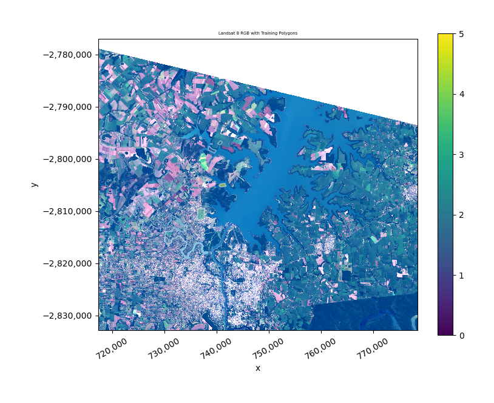
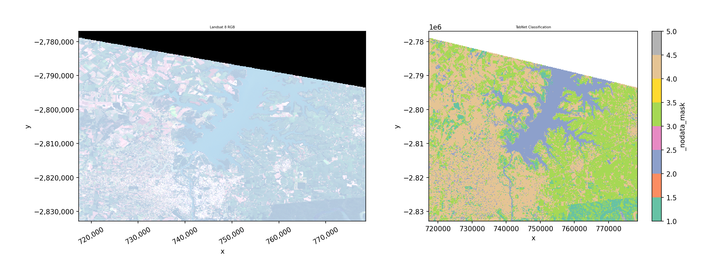
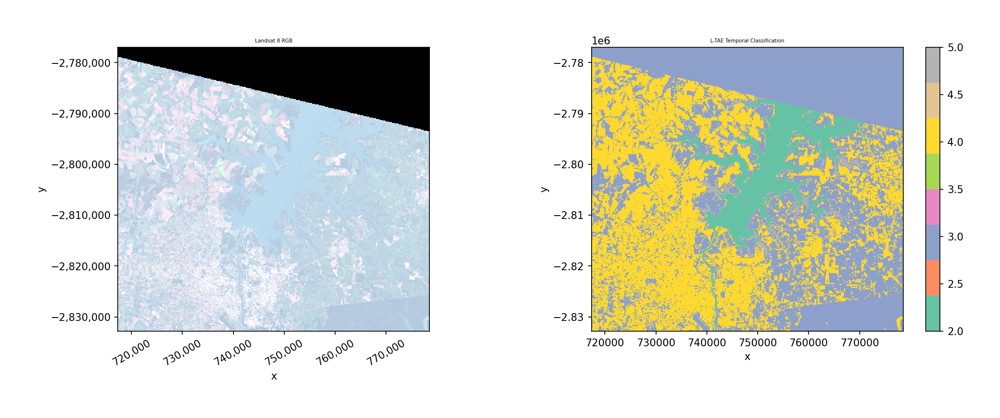
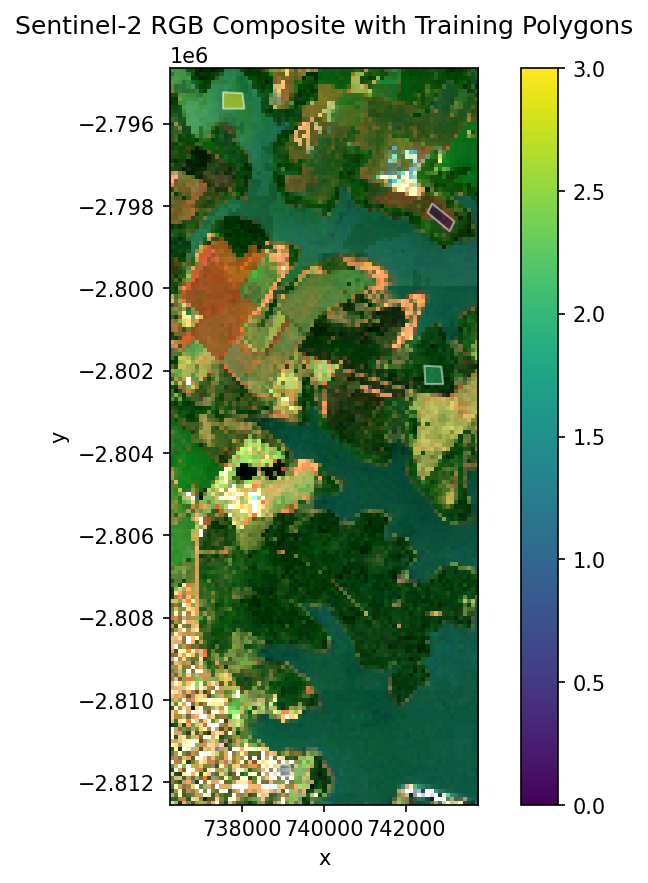
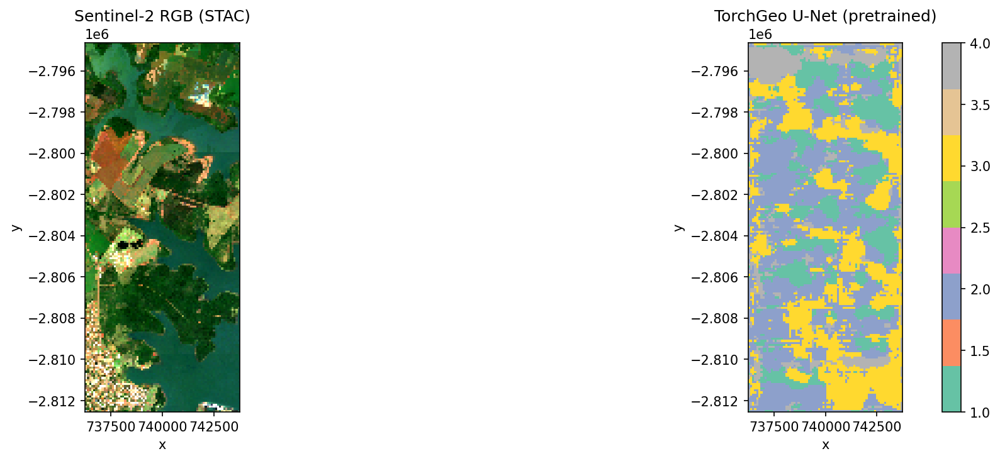
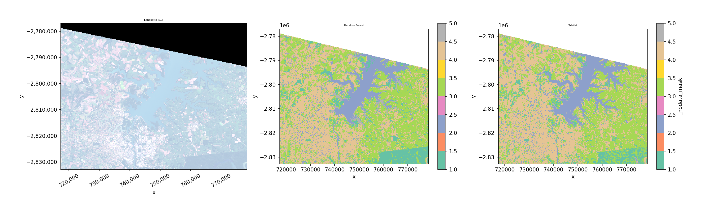

.. _dl:

Deep learning classifiers
=========================

GeoWombat provides deep learning classifiers that follow the same
``fit()`` / ``predict()`` / ``fit_predict()`` API as the sklearn-based
classifiers in the :ref:`ml` module. Three architectures are included:

.. list-table::
   :header-rows: 1
   :widths: 20 30 50

   * - Classifier
     - Architecture
     - Best for
   * - ``TabNetClassifier``
     - Attention-based tabular model
     - Pixel-wise classification from spectral bands (single or multi-date)
   * - ``LTAEClassifier``
     - Lightweight Temporal Attention Encoder
     - Satellite image time series (requires ``time`` dimension)
   * - ``TorchGeoClassifier``
     - U-Net, DeepLabV3+, FPN segmentation
     - Spatial-context classification with optional pre-trained encoders

Setup and installation
----------------------

Install the deep learning dependencies::

    pip install "geowombat[dl]"

This installs:

- `PyTorch <https://pytorch.org/>`_ (``torch>=2.0.0``)
- `pytorch-tabnet <https://github.com/dreamquark-ai/tabnet>`_ (``pytorch-tabnet>=4.0``)
- `TorchGeo <https://torchgeo.readthedocs.io/>`_ (``torchgeo>=0.6.0``)
- `segmentation-models-pytorch <https://github.com/qubvel-org/segmentation_models.pytorch>`_ (``segmentation-models-pytorch>=0.3.0``)

GPU setup
~~~~~~~~~

By default, classifiers run on CPU. To use a GPU, you need a CUDA-enabled
PyTorch installation. The easiest way is to follow the official
`PyTorch Get Started <https://pytorch.org/get-started/locally/>`_ page — select
your OS, package manager, and CUDA version to get the correct install command.

For example, with pip and CUDA 12.4::

    pip install torch --index-url https://download.pytorch.org/whl/cu124

To verify your GPU is available:

.. code-block:: python

    import torch
    print(torch.cuda.is_available())   # True if GPU is ready
    print(torch.cuda.device_count())   # Number of GPUs
    print(torch.cuda.get_device_name(0))  # GPU name

Then pass ``device='cuda'`` or ``device='auto'`` to any DL classifier::

    TabNetClassifier(device='cuda')
    LTAEClassifier(device='auto')      # auto-selects GPU if available
    TorchGeoClassifier(device='cuda')

Prepare training labels
-----------------------

All examples below use the bundled Landsat 8 test image and polygon labels.

.. code-block:: python

    import warnings
    warnings.filterwarnings('ignore')

    import matplotlib.pyplot as plt
    import geopandas as gpd
    import numpy as np
    from sklearn.preprocessing import LabelEncoder

    import geowombat as gw
    from geowombat.data import l8_224078_20200518, l8_224078_20200518_polygons
    from geowombat.ml import fit, fit_predict, predict

    # Load polygon labels and encode classes as integers
    labels = gpd.read_file(l8_224078_20200518_polygons)
    le = LabelEncoder()
    labels['lc'] = le.fit_transform(labels['name'])
    labels = labels.drop(columns=['name'])

    print(dict(zip(le.classes_, le.transform(le.classes_))))
    # {'crop': 0, 'developed': 1, 'tree': 2, 'water': 3}

TabNet
------

TabNet is an attention-based model for tabular data. Each pixel is treated as
a sample with spectral bands as features. It works on single-date or
multi-date imagery (bands are flattened to features).

``n_classes`` is **automatically inferred** from the label column — you never
need to specify it. Features are **standardized internally** before training.

Key parameters:

- ``max_epochs``: Training epochs (default 50)
- ``batch_size``: Mini-batch size (default 1024)
- ``patience``: Early stopping patience (default 10)
- ``device``: ``'cpu'``, ``'cuda'``, or ``'auto'``
- ``verbose``: 0 = silent, 1 = progress

fit_predict (one step)
~~~~~~~~~~~~~~~~~~~~~~

.. code-block:: python

    from geowombat.ml.dl_classifiers import TabNetClassifier

    with gw.config.update(ref_res=150):
        with gw.open(l8_224078_20200518, nodata=0) as src:
            y = fit_predict(
                src,
                TabNetClassifier(max_epochs=50, verbose=0),
                labels,
                col='lc',
            )

    print(y.shape)   # (1, 372, 408)
    print(y.dims)    # ('band', 'y', 'x')

TabNet: separate fit then predict
~~~~~~~~~~~~~~~~~~~~~~~~~~~~~~~~~

Use separate steps when you want to inspect the trained model, save it,
or predict on different data.

.. code-block:: python

    with gw.config.update(ref_res=150):
        with gw.open(l8_224078_20200518, nodata=0) as src:
            clf = TabNetClassifier(max_epochs=50, verbose=0)

            # Step 1: fit
            X, Xy, clf = fit(src, clf, labels, col='lc')
            print(clf.fitted_)      # True
            print(clf._n_classes)   # 4

            # Step 2: predict
            y = predict(src, X, clf)

L-TAE (Temporal Attention)
--------------------------

The Lightweight Temporal Attention Encoder (L-TAE) classifies pixels based
on their spectral trajectory across multiple dates. It uses multi-head
temporal attention with a learned master query.

**Requires** multi-temporal data with a ``time`` dimension (open with
``stack_dim='time'``). Raises ``ValueError`` if data has no time dimension.

Key parameters:

- ``n_head``: Attention heads (default 4)
- ``d_k``: Key dimension per head (default 32)
- ``d_model``: Embedding dimension (default 128)
- ``max_epochs``: Training epochs (default 50)
- ``lr``: Learning rate (default 1e-3)
- ``device``: ``'cpu'``, ``'cuda'``, or ``'auto'``

fit_predict with time-stacked data
~~~~~~~~~~~~~~~~~~~~~~~~~~~~~~~~~~

.. code-block:: python

    from geowombat.ml.dl_classifiers import LTAEClassifier

    with gw.config.update(ref_res=150):
        with gw.open(
            [l8_224078_20200518, l8_224078_20200518],
            stack_dim='time',
            nodata=0,
        ) as src:
            print(src.shape)  # (2, 3, 372, 408)
            print(src.dims)   # ('time', 'band', 'y', 'x')

            y = fit_predict(
                src,
                LTAEClassifier(
                    max_epochs=50, verbose=0,
                    d_model=32, d_k=8, n_head=2,
                ),
                labels,
                col='lc',
            )

.. note::

   This demo stacks the same image twice. In practice, use imagery from
   different acquisition dates — L-TAE is most useful when temporal
   patterns differ between classes (e.g., crop phenology vs. forest).

L-TAE: separate fit then predict
~~~~~~~~~~~~~~~~~~~~~~~~~~~~~~~~~

.. code-block:: python

    with gw.config.update(ref_res=150):
        with gw.open(
            [l8_224078_20200518, l8_224078_20200518],
            stack_dim='time',
            nodata=0,
        ) as src:
            clf = LTAEClassifier(
                max_epochs=50, verbose=0,
                d_model=32, d_k=8, n_head=2,
            )
            X, Xy, clf = fit(src, clf, labels, col='lc')
            y = predict(src, X, clf)

Error without time dimension
~~~~~~~~~~~~~~~~~~~~~~~~~~~~~

L-TAE raises a clear error if the data is missing the ``time`` dimension:

.. code-block:: python

    with gw.open(l8_224078_20200518, nodata=0) as src:
        clf = LTAEClassifier()
        fit(src, clf, labels, col='lc')
    # ValueError: LTAEClassifier requires multi-temporal data
    # with a 'time' dimension. Open data with stack_dim='time'.

TorchGeo segmentation models
-----------------------------

``TorchGeoClassifier`` wraps segmentation models from
`segmentation-models-pytorch <https://github.com/qubvel-org/segmentation_models.pytorch>`_
with optional pre-trained encoder weights from
`TorchGeo <https://torchgeo.readthedocs.io/>`_. It uses patch-based training
and sliding-window inference.

Supported models: ``unet``, ``deeplabv3+``, ``deeplabv3``, ``fcn`` (FPN).

Key parameters:

- ``model``: Model architecture (default ``'unet'``)
- ``backbone``: Encoder backbone (default ``'resnet18'``)
- ``weights``: TorchGeo weight name or ``None`` for random init
- ``patch_size``: Training/inference patch size (default 64)
- ``stride``: Inference stride (default ``patch_size // 2``)
- ``max_patches``: Max training patches (default 500)
- ``bands``: Band indices or names to select (optional)
- ``max_epochs``, ``batch_size``, ``lr``, ``device``

U-Net example
~~~~~~~~~~~~~

.. code-block:: python

    from geowombat.ml.dl_classifiers import TorchGeoClassifier

    with gw.config.update(ref_res=300):
        with gw.open(l8_224078_20200518, nodata=0) as src:
            clf = TorchGeoClassifier(
                model='unet',
                backbone='resnet18',
                weights=None,          # random init for demo
                patch_size=16,
                max_patches=20,
                max_epochs=2,
                batch_size=4,
                verbose=0,
            )
            y = fit_predict(src, clf, labels, col='lc')

Pre-trained encoder weights
~~~~~~~~~~~~~~~~~~~~~~~~~~~

TorchGeo provides encoder weights pre-trained on satellite imagery
(Sentinel-2, Landsat, NAIP). Use the ``weights`` parameter and
``bands`` to match the model's expected input:

.. code-block:: python

    # Sentinel-2 RGB pre-trained encoder
    clf = TorchGeoClassifier(
        model='unet',
        backbone='resnet18',
        weights='ResNet18_Weights.SENTINEL2_RGB_MOCO',
        bands=[1, 2, 3],        # select bands matching model
        patch_size=64,
    )

    # Check what bands the model expects
    print(clf.expected_bands)
    # {'in_chans': 3, 'meta': {...}}

If the number of input bands doesn't match the model's expectations,
a clear error is raised with guidance on how to fix it.

Available pretrained weights
~~~~~~~~~~~~~~~~~~~~~~~~~~~~

The table below summarizes the most common TorchGeo pretrained weight families.
See the ``notebooks/dl_classifiers.ipynb`` notebook for an interactive table
of all 60+ weights generated programmatically.

.. list-table::
   :header-rows: 1
   :widths: 25 10 35 30

   * - Sensor
     - Bands
     - Example Weight
     - Backbones
   * - Sentinel-2 RGB
     - 3
     - ``SENTINEL2_RGB_MOCO``
     - ResNet18, ResNet50
   * - Sentinel-2 All
     - 13
     - ``SENTINEL2_ALL_MOCO``
     - ResNet18, ResNet50, ViTSmall16
   * - Sentinel-2 MS
     - 9
     - ``SENTINEL2_MI_MS_SATLAS``
     - ResNet50, Swin_V2_B
   * - Landsat TM
     - 7
     - ``LANDSAT_TM_TOA_MOCO``
     - ResNet18, ResNet50
   * - Landsat OLI SR
     - 6
     - ``LANDSAT_OLI_SR_MOCO``
     - ResNet18, ResNet50
   * - Landsat OLI+TIRS
     - 11
     - ``LANDSAT_OLI_TIRS_TOA_MOCO``
     - ResNet18, ResNet50
   * - Sentinel-1 SAR
     - 2
     - ``SENTINEL1_ALL_MOCO``
     - ResNet50
   * - NAIP RGB
     - 3
     - ``NAIP_RGB_MI_SATLAS``
     - Swin_V2_B
   * - fMoW RGB
     - 3
     - ``FMOW_RGB_GASSL``
     - ResNet50

To use a weight, pass it as ``weights='<BackboneName>_Weights.<WEIGHT_NAME>'``.
For example::

    TorchGeoClassifier(
        backbone='resnet18',
        weights='ResNet18_Weights.SENTINEL2_RGB_MOCO',
        bands=[1, 2, 3],
    )

STAC + pretrained model example
~~~~~~~~~~~~~~~~~~~~~~~~~~~~~~~~

Download Sentinel-2 imagery from a STAC catalog and classify it using a
pretrained TorchGeo encoder. ``composite_stac()`` creates a cloud-free
median composite with automatic cloud masking via the Sentinel-2 SCL band.

.. code-block:: python

    from geowombat.core.stac import composite_stac
    from geowombat.ml.dl_classifiers import TorchGeoClassifier

    # Cloud-free yearly median composite
    data, metadata = composite_stac(
        stac_catalog="element84_v1",
        collection="sentinel_s2_l2a",
        bounds=(-54.65, -25.41, -54.58, -25.25),
        epsg=32621,
        bands=["red", "green", "blue"],
        start_date="2023-01-01",
        end_date="2023-12-31",
        cloud_cover_perc=30,
        resolution=100.0,
        frequency="YS",       # yearly composite
        agg="median",
        max_items=20,
        compute=True,
    )
    img = data.isel(time=0)

Classify the composite with a U-Net using a Sentinel-2 RGB pretrained encoder:

.. code-block:: python

    clf = TorchGeoClassifier(
        model='unet',
        backbone='resnet18',
        weights='ResNet18_Weights.SENTINEL2_RGB_MOCO',
        patch_size=32,
        max_epochs=5,
        batch_size=4,
        verbose=0,
    )
    y = fit_predict(img, clf, labels, col='lc')

.. note::

   ``composite_stac()`` requires network access and ``pip install geowombat[stac]``.
   See the ``notebooks/dl_classifiers.ipynb`` notebook for a runnable version
   with error handling for offline use.

Comparison with sklearn classifiers
------------------------------------

The DL classifiers use the exact same API as sklearn classifiers — just
swap the classifier object:

.. code-block:: python

    from sklearn.ensemble import RandomForestClassifier

    with gw.config.update(ref_res=150):
        with gw.open(l8_224078_20200518, nodata=0) as src:
            # sklearn
            y_rf = fit_predict(
                src, RandomForestClassifier(n_estimators=50),
                labels, col='lc',
            )
            # DL
            y_tabnet = fit_predict(
                src, TabNetClassifier(max_epochs=50, verbose=0),
                labels, col='lc',
            )

Notes
-----

- **n_classes is auto-inferred** from the label column during ``fit()``.
  You never need to specify it.
- **Feature normalization** is handled internally — raw DN values are
  standardized before training and prediction.
- **Labels use 1-based encoding** internally (0 = nodata). The classifiers
  convert to 0-based for PyTorch and back automatically.
- **Device**: Pass ``device='cuda'`` or ``device='auto'`` for GPU acceleration.
- For production workflows, increase ``max_epochs`` (e.g., 50–200) and use
  full-resolution data with more training samples.

Save predictions
----------------

.. code-block:: python

    y.gw.save('classification.tif', overwrite=True)
