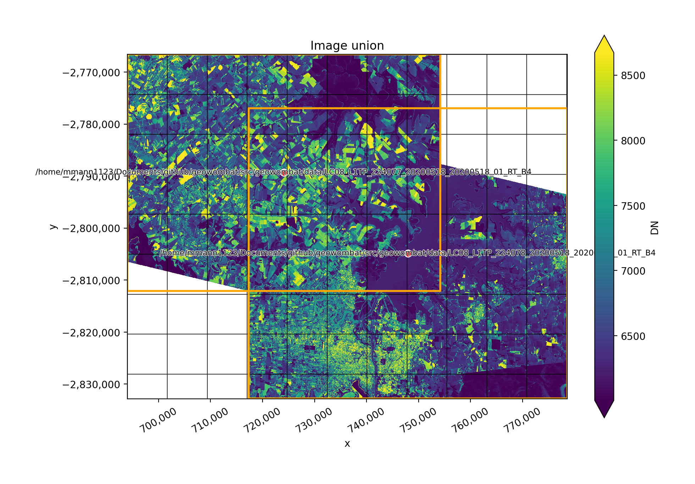

########################################
GeoWombat: Utilities for geospatial data
########################################

.. raw:: html

    

.. raw:: html

    

        Like a wombat, <b>geowombat</b> has a simple interface (for raster I/O) with a strong backend (for data processing at scale).
    

Raster & Remotely Sensed Data Made Easy
##########

GeoWombat provides utilities to process geospatial and time series of raster data at scale. Easily process Landsat, Sentinel, Planetscope or RGB data and others. 

**Common Remote Sensing Uses**

* Simple read/write for a variety of sensors (Landsat, Sentinel etc)
* Image mosaicing
* On-the-fly image transformations (reprojection)
* Point / polygon raster sampling, extraction
* Time series analysis
* Band math (NDVI, Tasseled cap, EVI etc)
* Image classification and regression
* Radiometry (BRDF normalization)
* Distributed processing 

**Mosaic Images Example**

.. raw:: html

    

    

        

:ref:`Get started with geowombat <install>`

.. raw:: html

        
    

**Computation scales easily over large datasets with minimal changes to the code**

.. code:: python

    # Set a reference image to align to
    with gw.config.update(ref_image='image_a.tif'):

        # Open images as Xarray DataArrays
        with gw.open('image_a.tif') as srca, \
            gw.open('image_b.tif') as srcb:

            # The size of srca, srcb, and results are determined by the configuration context
            results = srca.sel(band=1) * srcb.sel(band=[1, 2, 3]).mean(dim='band')

            # Initiate computation by writing the results to file.
            # Mix process and thread workers to execute the task in parallel.
            results.gw.to_raster('output.tif',
                                 n_workers=4,
                                 n_threads=4,
                                 compress='lzw')

For more details, see the `tutorials <tutorial.html>`_ and `examples <examples.html>`_.

The package is inspired by, and built on, several key libraries for large-scale data processing, such as `Dask <http://dask.org>`_, `Geopandas <http://geopandas.org>`_, `Pandas <http://pandas.pydata.org>`_, `Rasterio <https://rasterio.readthedocs.io>`_, and `Xarray <http://xarray.pydata.org>`_. GeoWombat interfaces directly with Xarray for raster I/O, which uses Rasterio to open raster files such as satellite images or aerial photos as `Dask arrays <https://docs.dask.org/en/latest/array.html>`_. GeoWombat uses the `Xarray register <http://xarray.pydata.org/en/stable/internals.html>`_ to extend the functionality of `Xarray DataArrays <http://xarray.pydata.org/en/stable/generated/xarray.DataArray.html>`_.

One of the key features of GeoWombat is the on-the-fly handling of multiple files. In particular, GeoWombat leverages Rasterio to transform and align rasters with varying projections and spatial resolutions. In addition to simplifying the process of data alignment, GeoWombat utilizes the `task graphs <https://docs.dask.org/en/latest/graphs.html>`_ of Dask arrays. By default, GeoWombat loads a raster as a DataArray, which points to the raster data on file using a chunked Dask array. This task graph feature simplifies parallel computations of one or more raster files of any size.

.. toctree::
   :maxdepth: 1
   :hidden:
   :caption: Getting Started

   install
   quick-overview
   tutorial
   examples

.. toctree::
   :maxdepth: 1
   :hidden:
   :caption: Changes

   changelog
   issues

.. toctree::
   :maxdepth: 1
   :hidden:
   :caption: Reference

   api
