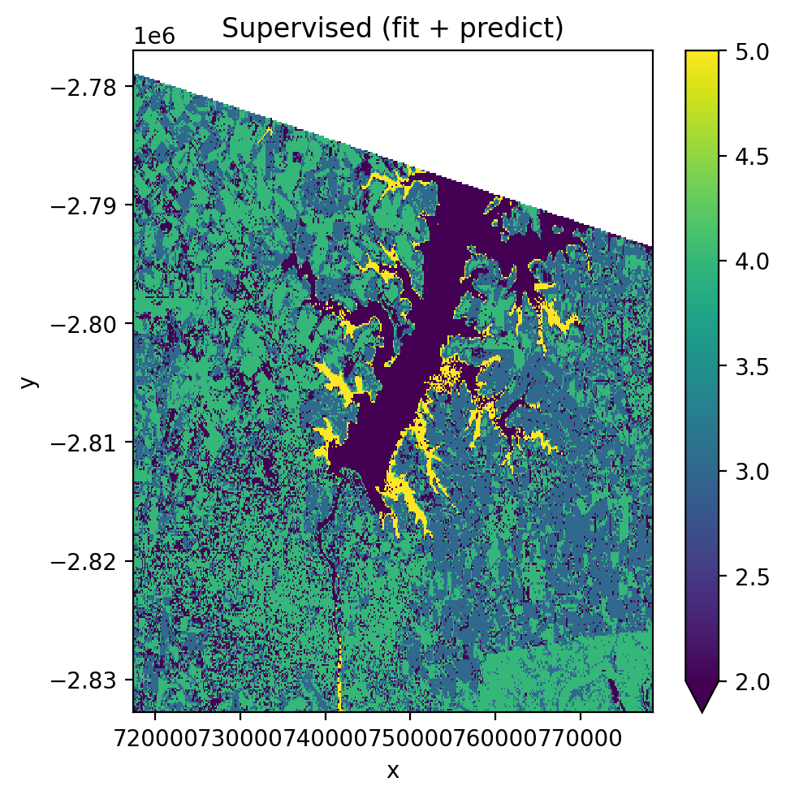
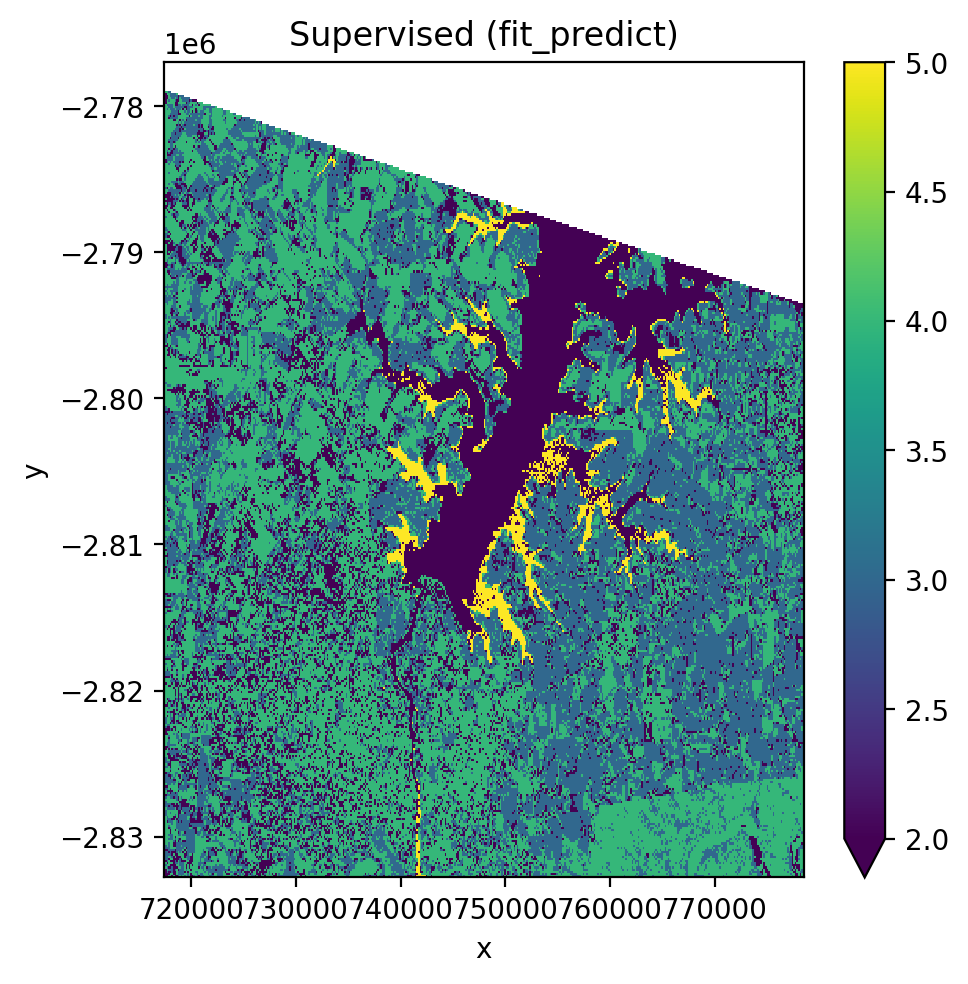
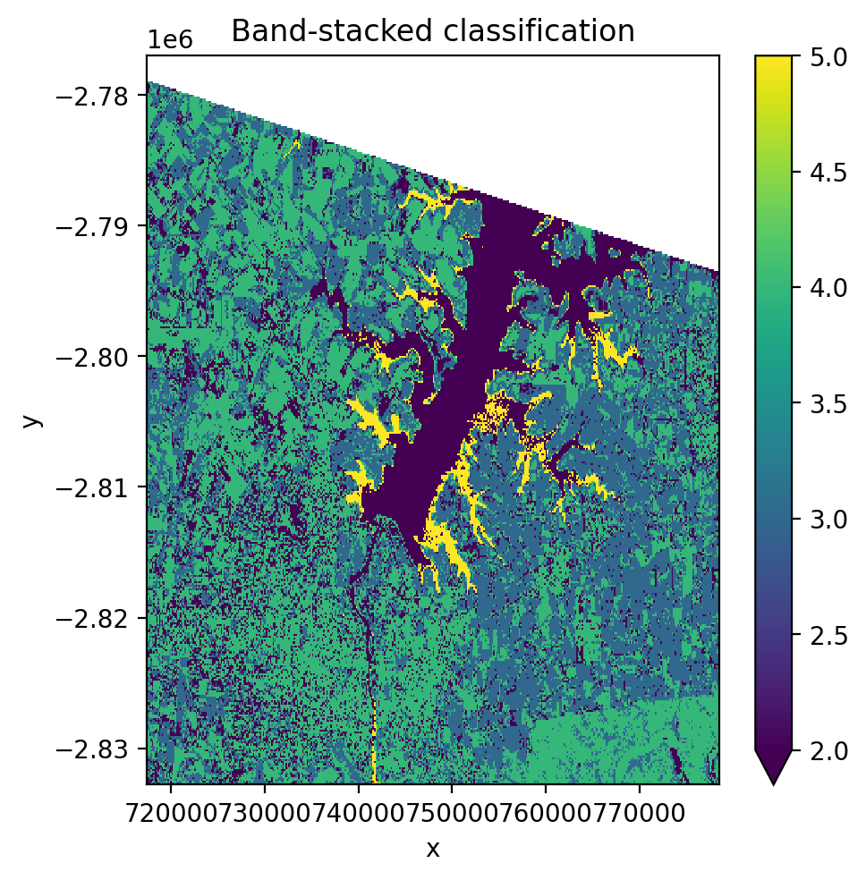
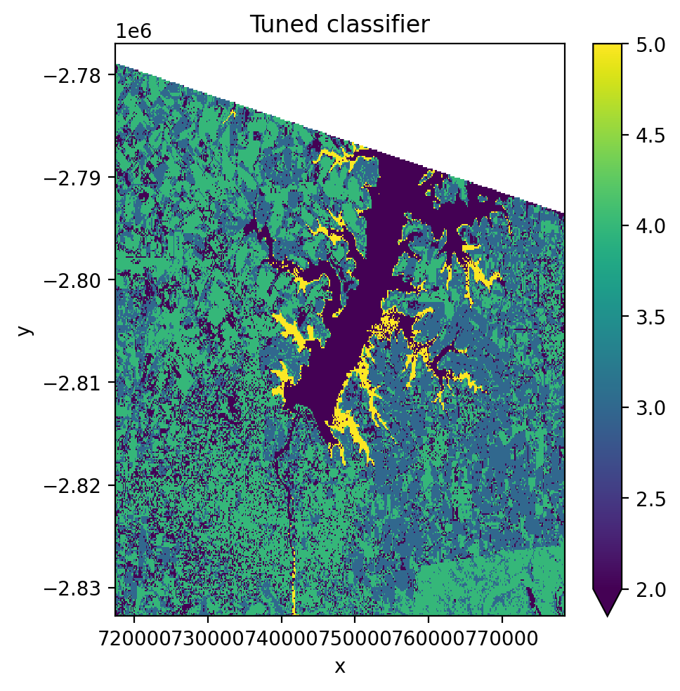
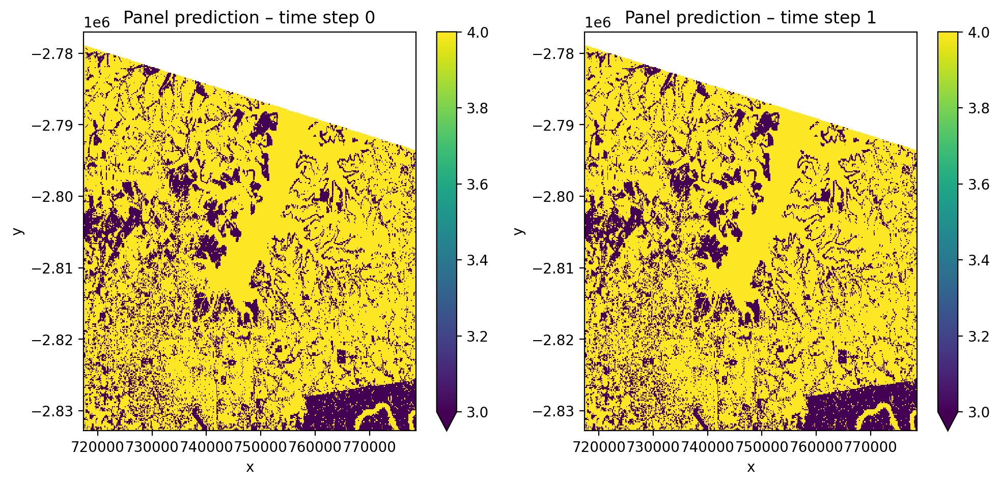
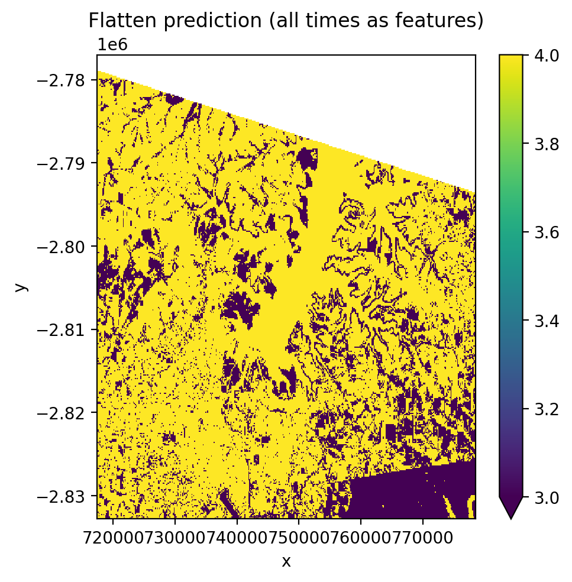
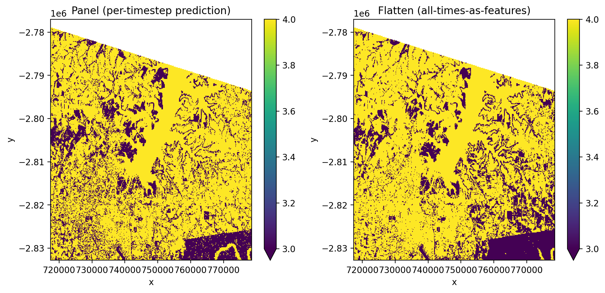
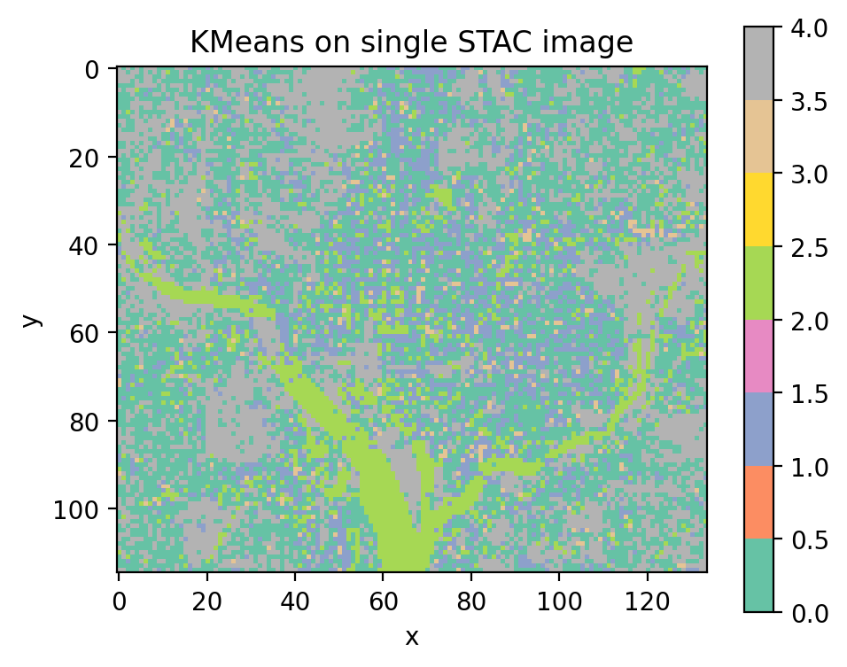

.. _ml:

Machine learning
================

GeoWombat's ML module works with any scikit-learn compatible classifier or
pipeline. Pass a classifier to :func:`~geowombat.ml.fit`,
:func:`~geowombat.ml.predict`, or :func:`~geowombat.ml.fit_predict` and it
will be applied to the raster data as an xarray DataArray.

To install ML dependencies::

    pip install "geowombat[ml]"

Recommended classifiers for remote sensing
------------------------------------------

Supervised
~~~~~~~~~~

.. list-table::
   :header-rows: 1
   :widths: 25 35 40

   * - Classifier
     - Module
     - Notes
   * - Random Forest
     - ``sklearn.ensemble.RandomForestClassifier``
     - Most widely used in remote sensing; handles high-dimensional data well, robust to noise
   * - LightGBM
     - ``lightgbm.LGBMClassifier``
     - Fast gradient boosting; strong accuracy with large datasets, supports categorical features
   * - Gradient Boosted Trees
     - ``sklearn.ensemble.GradientBoostingClassifier``
     - Strong accuracy; slower than LightGBM on large datasets
   * - Support Vector Machine
     - ``sklearn.svm.SVC``
     - Effective in high-dimensional spaces; works well with small training sets
   * - Gaussian Naive Bayes
     - ``sklearn.naive_bayes.GaussianNB``
     - Fast and simple baseline; assumes feature independence
   * - k-Nearest Neighbors
     - ``sklearn.neighbors.KNeighborsClassifier``
     - Non-parametric; useful for complex class boundaries

Unsupervised
~~~~~~~~~~~~

.. list-table::
   :header-rows: 1
   :widths: 25 35 40

   * - Classifier
     - Module
     - Notes
   * - K-Means
     - ``sklearn.cluster.KMeans``
     - Standard clustering; fast, works well for spectrally distinct classes
   * - Mini-Batch K-Means
     - ``sklearn.cluster.MiniBatchKMeans``
     - Faster K-Means variant for large rasters
   * - Gaussian Mixture Model
     - ``sklearn.mixture.GaussianMixture``
     - Soft clustering; models class overlap better than K-Means

Setup
-----

.. code-block:: python

    import geowombat as gw
    from geowombat.data import (
        l8_224078_20200518,
        l8_224078_20200518_points,
        stac_training,
    )
    from geowombat.ml import fit, predict, fit_predict

    import geopandas as gpd
    import matplotlib.pyplot as plt
    import numpy as np
    from sklearn.pipeline import Pipeline
    from sklearn.preprocessing import LabelEncoder, StandardScaler
    from sklearn.decomposition import PCA
    from sklearn.naive_bayes import GaussianNB
    from sklearn.cluster import KMeans

    # Polygon labels (integer 'lc' column, EPSG:4326)
    labels_poly = gpd.read_file(stac_training)

    # Point labels (need LabelEncoder for string names)
    le = LabelEncoder()
    labels_point = gpd.read_file(l8_224078_20200518_points)
    labels_point['lc'] = le.fit(labels_point.name).transform(labels_point.name)
    labels_point = labels_point.drop(columns=['name'])

Nodata handling
---------------

By default, ``fit_predict()`` and ``predict()`` mask nodata pixels in the
output with NaN (``mask_nodataval=True``). This prevents nodata regions from
being assigned a class label.

When opening a file with ``gw.open(..., nodata=0)``, GeoWombat builds a
binary nodata mask from the original file *before* warping. This mask is
attached as the ``_nodata_mask`` coordinate and survives reprojection and
time-stacking. The ``_mask_nodata()`` method uses it to replace predictions
at nodata locations with NaN.

.. code-block:: python

    with gw.config.update(ref_res=150):
        with gw.open(l8_224078_20200518, nodata=0) as src:
            # _nodata_mask is automatically attached
            print('Has nodata mask:', '_nodata_mask' in src.coords)

            # mask_nodataval=True (default) masks nodata in predictions
            y = fit_predict(src, pl, labels_poly, col='lc')

To disable nodata masking, pass ``mask_nodataval=False``. This is useful
when you want to handle masking yourself or inspect raw predictions.

Supervised classification
-------------------------

Using ``fit()`` then ``predict()`` (two-step)
~~~~~~~~~~~~~~~~~~~~~~~~~~~~~~~~~~~~~~~~~~~~~

.. code-block:: python

    pl = Pipeline([
        ('scaler', StandardScaler()),
        ('pca', PCA()),
        ('clf', GaussianNB()),
    ])

    with gw.config.update(ref_res=150):
        with gw.open(l8_224078_20200518, nodata=0) as src:
            X, Xy, clf = fit(src, pl, labels_poly, col='lc')
            y = predict(src, X, clf)
            y.plot(robust=True)

Using ``fit_predict()`` (one-step)
~~~~~~~~~~~~~~~~~~~~~~~~~~~~~~~~~~

.. code-block:: python

    with gw.config.update(ref_res=150):
        with gw.open(l8_224078_20200518, nodata=0) as src:
            y = fit_predict(src, pl, labels_poly, col='lc')
            y.plot(robust=True)

Unsupervised classification (KMeans)
-------------------------------------

No training labels needed. The algorithm identifies clusters directly from
the pixel values.

.. code-block:: python

    cl = Pipeline([('clf', KMeans(n_clusters=6, random_state=0))])

    with gw.config.update(ref_res=150):
        with gw.open(l8_224078_20200518, nodata=0) as src:
            y = fit_predict(src, cl)
            y.plot(robust=True)

.. image:: _static/ml_unsupervised_predict.png
   :width: 500px
   :alt: Unsupervised KMeans classification

Band-stacked classification
-----------------------------

Stack multiple images along the band dimension with ``stack_dim='band'``.
This concatenates spectral bands from each date into one long feature vector
per pixel.

.. code-block:: python

    with gw.config.update(ref_res=150):
        with gw.open(
            [l8_224078_20200518, l8_224078_20200518],
            stack_dim='band',
            nodata=0,
        ) as src:
            print('Band-stacked shape:', src.shape)
            y = fit_predict(src, pl, labels_poly, col='lc')
            y.plot(robust=True)

Cross-validation and hyperparameter tuning
-------------------------------------------

Use ``GridSearchCV`` with ``CrossValidatorWrapper`` to tune pipeline
hyperparameters.

.. code-block:: python

    from sklearn.model_selection import GridSearchCV, KFold
    from sklearn_xarray.model_selection import CrossValidatorWrapper

    cv = CrossValidatorWrapper(KFold())
    gridsearch = GridSearchCV(
        pl,
        cv=cv,
        scoring='balanced_accuracy',
        param_grid={
            'scaler__with_std': [True, False],
            'pca__n_components': [1, 2, 3],
        },
    )

    with gw.config.update(ref_res=150):
        with gw.open(l8_224078_20200518, nodata=0) as src:
            X, Xy, pipe = fit(src, pl, labels_poly, col='lc')

            gridsearch.fit(*Xy)
            print('Best params:', gridsearch.best_params_)

            pipe.set_params(**gridsearch.best_params_)
            y = predict(src, X, pipe)
            y.plot(robust=True)

Time-stacked classification with ``temporal_mode``
---------------------------------------------------

When opening multiple images with ``stack_dim='time'``, the data has shape
``(time, band, y, x)``. This is the format returned by STAC queries and
multi-date ``gw.open()`` calls. The ``temporal_mode`` parameter controls how
time is handled during classification:

- ``'panel'`` (default) — each pixel-time is an independent sample with B
  spectral features. Output retains the time dimension with one prediction
  per time step.
- ``'flatten'`` — all time steps are flattened into the band dimension,
  creating T×B features per pixel. Output has no time dimension.

.. list-table::
   :header-rows: 1
   :widths: 25 15 15 30

   * - Input
     - ``temporal_mode``
     - Features
     - Output shape
   * - ``(time=T, band=B, y, x)``
     - ``'panel'``
     - B
     - ``(time=T, band='targ', y, x)``
   * - ``(time=T, band=B, y, x)``
     - ``'flatten'``
     - T × B
     - ``(band='targ', y, x)``

Panel mode
~~~~~~~~~~

Each pixel-time combination is treated as an independent sample. The output
retains the time dimension, giving one prediction map per time step. Nodata
pixels are masked automatically (``mask_nodataval=True`` by default).

.. code-block:: python

    pl_panel = Pipeline([
        ('scaler', StandardScaler()),
        ('pca', PCA()),
        ('clf', GaussianNB()),
    ])

    with gw.config.update(ref_res=150):
        with gw.open(
            [l8_224078_20200518, l8_224078_20200518],
            stack_dim='time',
            nodata=0,
        ) as src:
            y_panel = fit_predict(
                src, pl_panel, labels_point, col='lc',
                temporal_mode='panel',
            )

    print(f'Shape: {y_panel.shape}')  # (2, 1, 372, 408)
    print(f'Dims:  {y_panel.dims}')   # ('time', 'band', 'y', 'x')

    # Since both time steps use the same image, predictions should match
    print('Time steps identical:',
          np.allclose(y_panel.isel(time=0).values,
                      y_panel.isel(time=1).values, equal_nan=True))

Flatten mode
~~~~~~~~~~~~

All time steps are flattened into the band dimension, creating T×B features
per pixel. This produces a single prediction map regardless of how many
time steps exist.

.. code-block:: python

    pl_flatten = Pipeline([
        ('scaler', StandardScaler()),
        ('pca', PCA(n_components=1)),
        ('clf', GaussianNB()),
    ])

    with gw.config.update(ref_res=150):
        with gw.open(
            [l8_224078_20200518, l8_224078_20200518],
            stack_dim='time',
            nodata=0,
        ) as src:
            y_flat = fit_predict(
                src, pl_flatten, labels_point, col='lc',
                temporal_mode='flatten',
            )

    print(f'Shape: {y_flat.shape}')  # (1, 372, 408)
    print(f'Dims:  {y_flat.dims}')   # ('band', 'y', 'x')

Unsupervised clustering with time-stacked data
~~~~~~~~~~~~~~~~~~~~~~~~~~~~~~~~~~~~~~~~~~~~~~~

.. code-block:: python

    cl_time = Pipeline([
        ('scaler', StandardScaler()),
        ('clf', KMeans(n_clusters=4, random_state=0)),
    ])

    with gw.config.update(ref_res=150):
        with gw.open(
            [l8_224078_20200518, l8_224078_20200518],
            stack_dim='time',
            nodata=0,
        ) as src:
            y_cl = fit_predict(
                data=src, clf=cl_time,
                temporal_mode='panel',
            )

.. image:: _static/ml_cluster_time.png
   :width: 700px
   :alt: Unsupervised panel clustering over time

Compare panel vs flatten
~~~~~~~~~~~~~~~~~~~~~~~~

Classification with STAC satellite imagery
--------------------------------------------

GeoWombat can stream satellite imagery directly from cloud catalogs using
``open_stac()``. The returned data has shape ``(time, band, y, x)`` and works
directly with ``fit_predict()``. No file downloads are needed — data is read
from Cloud Optimized GeoTIFFs (COGs) on the fly.

To install STAC dependencies::

    pip install "geowombat[stac]"

Search and load imagery
~~~~~~~~~~~~~~~~~~~~~~~

Use ``open_stac()`` to search a STAC catalog and load the matching scenes.
Set ``compute=True`` to download the data into memory with a progress bar.

.. code-block:: python

    from geowombat.core.stac import open_stac

    # Search for Sentinel-2 imagery over Washington, DC
    data, df = open_stac(
        stac_catalog="element84_v1",
        collection="sentinel_s2_l2a",
        bounds=(-77.1, 38.85, -76.95, 38.95),
        epsg=32618,
        bands=["blue", "green", "red", "nir"],
        start_date="2023-06-01",
        end_date="2023-07-31",
        cloud_cover_perc=20,
        resolution=100.0,
        chunksize=256,
        max_items=2,
        compute=True,
    )

    print(f"Shape: {data.shape}")   # (2, 4, 115, 134)
    print(f"Dims:  {data.dims}")    # ('time', 'band', 'y', 'x')

.. image:: _static/stac_sentinel2_rgb.png
    :width: 400px

Unsupervised classification on a single STAC image
~~~~~~~~~~~~~~~~~~~~~~~~~~~~~~~~~~~~~~~~~~~~~~~~~~~

Select one time step with ``.isel(time=0)`` and pass it directly to
``fit_predict()``. No training labels are needed for unsupervised classifiers.

.. code-block:: python

    from sklearn.cluster import MiniBatchKMeans

    cl_stac = Pipeline([
        ("clf", MiniBatchKMeans(n_clusters=5, random_state=0)),
    ])

    single_image = data.isel(time=0)
    y_single = fit_predict(data=single_image, clf=cl_stac)
    y_single.plot(robust=True)

Save prediction output
----------------------

.. code-block:: python

    y.gw.save('output.tif', overwrite=True)
