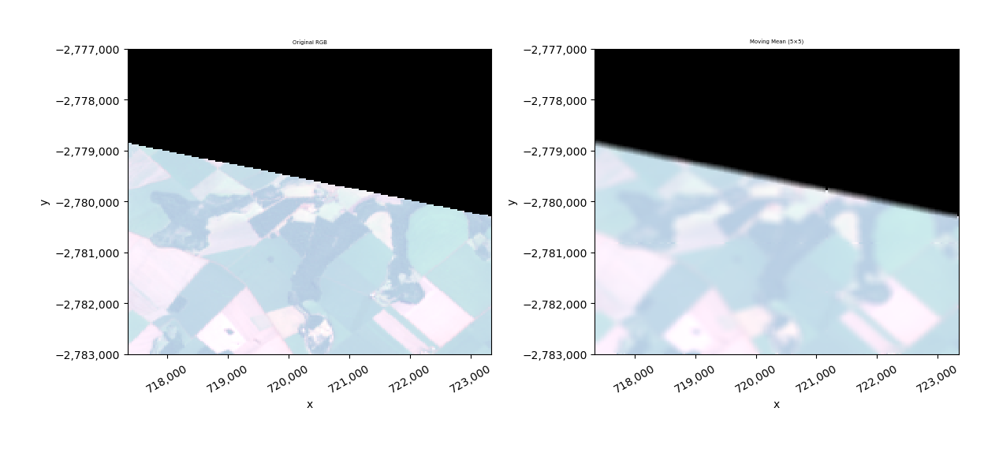
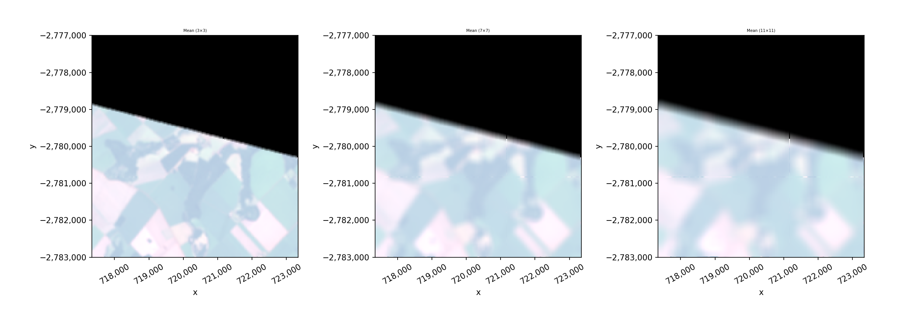
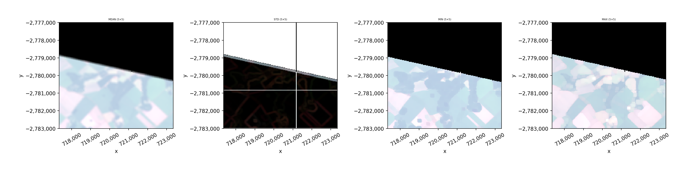
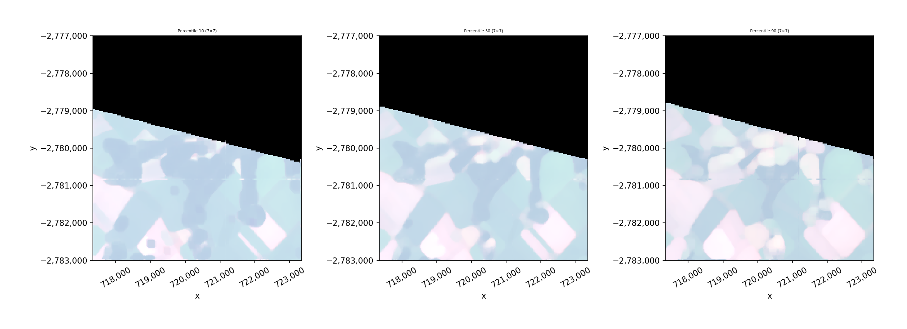
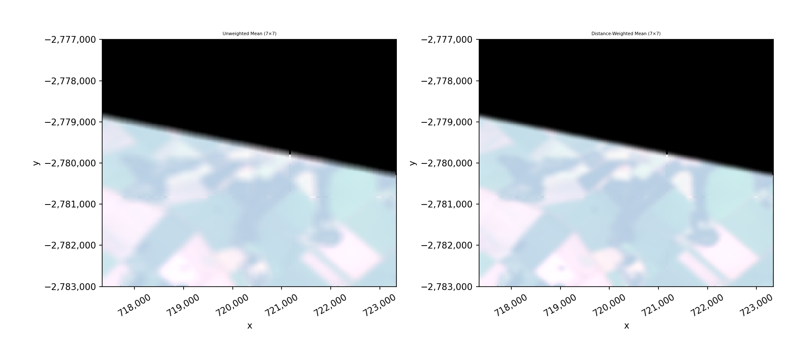

.. _moving:

Moving windows
==============

Moving window (focal) operations apply a statistic within a sliding
neighborhood around each pixel. This is useful for smoothing, texture
analysis, and edge detection on raster data.

``src.gw.moving()`` supports the following statistics:
``'mean'``, ``'std'``, ``'var'``, ``'min'``, ``'max'``, ``'perc'``.
Window sizes must be odd integers (3, 5, 7, 11, ...). Each band is
processed independently.

See the :func:`geowombat.moving` API reference and the
``notebooks/moving_windows.ipynb`` notebook for interactive examples.

Setup
-----

All examples below use the bundled Landsat 8 test image, subset to a
small region with ``gw.config.update(ref_bounds=...)`` for speed and
better visualization.

.. code-block:: python

    import geowombat as gw
    from geowombat.data import l8_224078_20200518
    import matplotlib.pyplot as plt

    # Small subset in the upper-left of the image (EPSG:32621)
    BOUNDS = (717345, -2783000, 723345, -2777000)

Basic usage: moving mean
------------------------

Average pixel values within a 5x5 neighborhood. Set ``nodata=0`` to
exclude zero-valued pixels from the computation. Use ``.where(src != 0)``
to mask the nodata region in the result.

.. code-block:: python

    with gw.config.update(ref_bounds=BOUNDS):
        with gw.open(l8_224078_20200518, chunks=128, nodata=0) as src:
            result_mean = src.gw.moving(stat='mean', w=5, nodata=0)
            result_mean = result_mean.where(src != 0)

            fig, axes = plt.subplots(1, 2, figsize=(12, 5))
            src.sel(band=[3, 2, 1]).gw.imshow(
                mask=True, nodata=0, robust=True, ax=axes[0]
            )
            axes[0].set_title('Original RGB')
            result_mean.sel(band=[3, 2, 1]).gw.imshow(
                mask=True, nodata=0, robust=True, ax=axes[1]
            )
            axes[1].set_title('Moving Mean (5x5)')
            plt.tight_layout()
            plt.show()

Comparing window sizes
----------------------

Larger windows produce stronger smoothing.

.. code-block:: python

    with gw.config.update(ref_bounds=BOUNDS):
        with gw.open(l8_224078_20200518, chunks=128, nodata=0) as src:
            sizes = [3, 7, 11]
            fig, axes = plt.subplots(1, 3, figsize=(15, 5))

            for ax, w in zip(axes, sizes):
                result = src.gw.moving(stat='mean', w=w, nodata=0)
                result = result.where(src != 0)
                result.sel(band=[3, 2, 1]).gw.imshow(
                    mask=True, nodata=0, robust=True, ax=ax
                )
                ax.set_title(f'Mean ({w}x{w})')

            plt.tight_layout()
            plt.show()

Different statistics
--------------------

Beyond the mean, compute standard deviation (texture), min/max
(morphological-style operations), and variance within the window.

.. code-block:: python

    with gw.config.update(ref_bounds=BOUNDS):
        with gw.open(l8_224078_20200518, chunks=128, nodata=0) as src:
            stats = ['mean', 'std', 'min', 'max']
            fig, axes = plt.subplots(1, 4, figsize=(18, 4))

            for ax, stat in zip(axes, stats):
                result = src.gw.moving(stat=stat, w=5, nodata=0)
                result = result.where(src != 0)
                result.sel(band=[3, 2, 1]).gw.imshow(
                    mask=True, nodata=0, robust=True, ax=ax
                )
                ax.set_title(f'{stat.upper()} (5x5)')

            plt.tight_layout()
            plt.show()

Percentile filter
-----------------

Use ``stat='perc'`` with the ``perc`` parameter to compute a specific
percentile within the window. This is useful for robust smoothing
(e.g., median with ``perc=50``) or highlighting bright/dark features.

.. code-block:: python

    with gw.config.update(ref_bounds=BOUNDS):
        with gw.open(l8_224078_20200518, chunks=128, nodata=0) as src:
            percentiles = [10, 50, 90]
            fig, axes = plt.subplots(1, 3, figsize=(15, 5))

            for ax, perc in zip(axes, percentiles):
                result = src.gw.moving(
                    stat='perc', perc=perc, w=7, nodata=0
                )
                result = result.where(src != 0)
                result.sel(band=[3, 2, 1]).gw.imshow(
                    mask=True, nodata=0, robust=True, ax=ax
                )
                ax.set_title(f'Percentile {perc} (7x7)')

            plt.tight_layout()
            plt.show()

Distance-weighted moving window
--------------------------------

Setting ``weights=True`` weights each pixel by its distance from the
window center, giving more influence to nearby pixels. This produces
a smoother result similar to a Gaussian-like filter.

.. code-block:: python

    with gw.config.update(ref_bounds=BOUNDS):
        with gw.open(l8_224078_20200518, chunks=128, nodata=0) as src:
            result_unweighted = src.gw.moving(
                stat='mean', w=7, nodata=0
            )
            result_unweighted = result_unweighted.where(src != 0)
            result_weighted = src.gw.moving(
                stat='mean', w=7, nodata=0, weights=True
            )
            result_weighted = result_weighted.where(src != 0)

            fig, axes = plt.subplots(1, 2, figsize=(12, 5))
            result_unweighted.sel(band=[3, 2, 1]).gw.imshow(
                mask=True, nodata=0, robust=True, ax=axes[0]
            )
            axes[0].set_title('Unweighted Mean (7x7)')
            result_weighted.sel(band=[3, 2, 1]).gw.imshow(
                mask=True, nodata=0, robust=True, ax=axes[1]
            )
            axes[1].set_title('Distance-Weighted Mean (7x7)')
            plt.tight_layout()
            plt.show()

Saving results
--------------

Moving window results are lazy dask arrays. Use ``.gw.save()`` to write
to disk or ``.compute()`` to load into memory.

.. code-block:: python

    with gw.config.update(ref_bounds=BOUNDS):
        with gw.open(l8_224078_20200518, chunks=128) as src:
            result = src.gw.moving(stat='mean', w=5, nodata=0)

            # Compute into memory
            result_computed = result.compute()

            # Save to file
            result.gw.save('smoothed_output.tif', overwrite=True)

Notes
-----

- **Nodata handling**: Pass ``nodata=0`` (or your nodata value) to
  ``moving()`` so those pixels are excluded from the window computation.
  Then mask the result with ``.where(src != 0)`` to set nodata regions
  to NaN for display and downstream analysis.
- **Window size** must be an odd integer. Even values raise an error.
- **Multi-band**: Each band is processed independently. The result has
  the same shape as the input.
- **Chunks**: Moving windows use dask ``map_overlap`` with reflected
  boundaries. Chunk borders are handled transparently.
