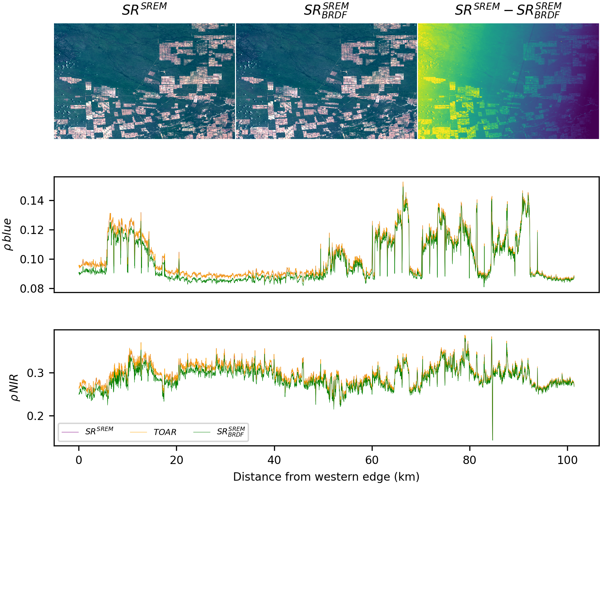

.. _radiometry:

Radiometry
==========

BRDF-adjusted surface reflectance
---------------------------------

GeoWombat uses the global c-factor method by `Roy et al. (2016) <https://www.sciencedirect.com/science/article/pii/S0034425716300220>`_
to apply BRDF normalization on surface reflectance data.

In the example below, we use :func:`norm_brdf` to normalize a Landsat 8 surface reflectance image.

.. code:: python

    import geowombat as gw
    from geowombat.radiometry import RadTransforms
    from geowombat.radiometry import BRDF

    rt = RadTransforms()
    brdf = BRDF()

    # 2,3,4,5,6,7 = blue,green,red,nir,swir1,swir2
    b2 = 'LC08_L1TP_228074_20190120_20190120_01_RT_B2.TIF'
    b3 = 'LC08_L1TP_228074_20190120_20190120_01_RT_B3.TIF'
    b4 = 'LC08_L1TP_228074_20190120_20190120_01_RT_B4.TIF'
    b5 = 'LC08_L1TP_228074_20190120_20190120_01_RT_B5.TIF'
    b6 = 'LC08_L1TP_228074_20190120_20190120_01_RT_B6.TIF'
    b7 = 'LC08_L1TP_228074_20190120_20190120_01_RT_B7.TIF'
    metadata = 'LC08_L1TP_228074_20190120_20190120_01_RT_MTL.txt'
    angles = 'LC08_L1TP_228074_20190120_20190120_01_RT_ANG.txt'

    band_names = ['blue', 'green', 'red', 'nir', 'swir1', 'swir2']
    band_list = [b2, b3, b4, b5, b6, b7]

    ref_bounds = (199374.91, -2294491.38, 244674.40, -2263229.42)
    nodataval = 65535
    chunks = 256

    meta = rt.get_landsat_coefficients(metadata)

    angle_info = landsat_pixel_angles(angles,
                                      str(b3),         # reference file
                                      str(main_path),  # output path
                                      meta.sensor,
                                      l57_angles_path='../geowombat/bin/ESPA/landsat_angles',
                                      l8_angles_path='../geowombat/bin/ESPA/l8_angles',
                                      verbose=1)

    solar_zenith = 'LC08_L1TP_228074_20190120_20190120_01_RT_solar_zenith.tif'
    solar_azimuth = 'LC08_L1TP_228074_20190120_20190120_01_RT_solar_azimuth.tif'
    sensor_zenith = 'LC08_L1TP_228074_20190120_20190120_01_RT_sensor_zenith.tif'
    sensor_azimuth = 'LC08_L1TP_228074_20190120_20190120_01_RT_sensor_azimuth.tif'

    with gw.config.update(sensor='l8l7', ref_bounds=ref_bounds, ignore_warnings=True):

        with gw.open(band_list, stack_dim='band', chunks=chunks) as src, \
            gw.open(solar_zenith, chunks=chunks) as solar_za, \
                gw.open(solar_azimuth, chunks=chunks) as solar_az, \
                    gw.open(sensor_zenith, chunks=chunks) as sensor_za, \
                        gw.open(sensor_azimuth, chunks=chunks) as sensor_az:

            sr = rt.dn_to_sr(src,
                             solar_za, solar_az, sensor_za, sensor_az,
                             sensor='l8',
                             meta=meta,
                             method='srem',
                             src_nodata=nodataval,
                             dst_nodata=nodataval)

            sr_brdf = br.norm_brdf(sr,
                                   solar_za, solar_az, sensor_za, sensor_az,
                                   sensor='l8',
                                   wavelengths=src.band.values.tolist(),
                                   src_nodata=nodataval,
                                   dst_nodata=nodataval)

