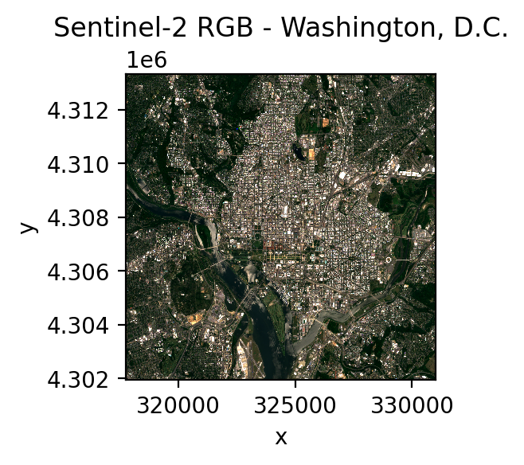

.. _web:

Accessing STAC Catalogs
=======================

GeoWombat integrates easy access to Spatial Temporal Asset Catalog (`STAC <https://stacspec.org/en>`_) APIs.
STAC is a standardized way to expose collections of spatial temporal data. Instead of downloading
large files, STAC lets you search for exactly the imagery you need (by location, date, and cloud cover)
and stream it directly into your analysis. For a full list of public STAC APIs, refer to the
`STAC datasets page <https://stacspec.org/en/about/datasets/>`_.

Installation
------------

To install ``geowombat`` with STAC functionality::

    pip install "geowombat[stac]"

This installs the required dependencies: ``pystac``, ``pystac_client``, ``stackstac``,
and ``planetary_computer``.

Supported catalogs and collections
----------------------------------

:func:`geowombat.core.stac.open_stac` supports the following STAC catalogs:

.. list-table::
   :header-rows: 1
   :widths: 25 75

   * - Catalog
     - Collections
   * - ``element84_v0``
     - ``sentinel_s2_l2a_cogs``
   * - ``element84_v1``
     - ``cop_dem_glo_30``, ``landsat_c2_l2``, ``sentinel_s2_l2a``, ``sentinel_s2_l1c``, ``sentinel_s1_l1c``, ``naip``
   * - ``microsoft_v1``
     - ``cop_dem_glo_30``, ``landsat_c2_l1``, ``landsat_c2_l2``, ``landsat_l8_c2_l2``, ``sentinel_s2_l2a``, ``sentinel_s1_l1c``, ``sentinel_3_lst``, ``io_lulc``, ``usda_cdl``, ``hls``, ``esa_worldcover``

STAC examples
-------------

Stream Sentinel-2 data from Element 84
~~~~~~~~~~~~~~~~~~~~~~~~~~~~~~~~~~~~~~~

The following example streams Sentinel-2 Level 2A (surface reflectance) bands for
the Washington, D.C. area using `Element 84's <https://www.element84.com/>`_ STAC catalog.

.. code:: python

    from geowombat.core.stac import open_stac

    data, df = open_stac(
        stac_catalog="element84_v1",
        bounds=(-77.1, 38.85, -76.95, 38.95),  # DC area (left, bottom, right, top)
        epsg=32618,  # UTM Zone 18N
        collection="sentinel_s2_l2a",  # Sentinel-2 Level 2A (surface reflectance)
        bands=["blue", "green", "red", "nir"],
        cloud_cover_perc=20,
        start_date="2023-06-01",
        end_date="2023-07-31",
        resolution=10.0,
        chunksize=512,
    )

    # data is a lazy dask-backed xarray DataArray with dims (time, band, y, x)
    print(data)

Plot the results:

.. code:: python

    import matplotlib.pyplot as plt

    fig, ax = plt.subplots(dpi=200, figsize=(3, 3))
    data.sel(time=data.time[0], band=["red", "green", "blue"]).plot.imshow(
        robust=True, ax=ax
    )
    ax.set_title("Sentinel-2 RGB - Washington, D.C.")
    plt.tight_layout(pad=1)

Stream Landsat data from Microsoft Planetary Computer
~~~~~~~~~~~~~~~~~~~~~~~~~~~~~~~~~~~~~~~~~~~~~~~~~~~~~

.. code:: python

    from geowombat.core.stac import open_stac

    data_l, df_l = open_stac(
        stac_catalog='microsoft_v1',
        collection='landsat_c2_l2',
        bounds=(-77.1, 38.85, -76.95, 38.95),
        epsg=32618,
        bands=['red', 'green', 'blue', 'qa_pixel'],
        mask_data=True,
        start_date='2023-06-01',
        end_date='2023-07-31',
        resolution=30.0,
        chunksize=512,
    )

    print(data_l)

.. code:: python

    fig, ax = plt.subplots(dpi=200, figsize=(3, 3))
    data_l.sel(time=data_l.time[0], band=["red", "green", "blue"]).plot.imshow(
        robust=True, ax=ax
    )
    ax.set_title("Landsat RGB - Washington, D.C.")
    plt.tight_layout(pad=1)

.. note::

    When using ``mask_data=True`` with a ``qa_pixel`` band, cloud and shadow pixels
    are automatically masked. The ``qa_pixel`` band is removed from the output after masking.
    Add ``max_items=10`` to cap the number of scenes returned.

Merge multiple collections
~~~~~~~~~~~~~~~~~~~~~~~~~~

Use :func:`geowombat.core.stac.merge_stac` to combine data from different sensors
into a single time series:

.. code:: python

    from geowombat.core.stac import open_stac, merge_stac
    from rasterio.enums import Resampling

    # Load Landsat
    data_l, df_l = open_stac(
        stac_catalog="microsoft_v1",
        collection="landsat_c2_l2",
        bounds=(-77.1, 38.85, -76.95, 38.95),
        bands=["red", "green", "blue", "qa_pixel"],
        mask_data=True,
        start_date="2023-01-01",
        end_date="2023-12-31",
        epsg=32618,
        resolution=30.0,
    )

    # Load Sentinel-2, reprojected to match Landsat
    data_s2, df_s2 = open_stac(
        stac_catalog="element84_v1",
        collection="sentinel_s2_l2a",
        bounds=(-77.1, 38.85, -76.95, 38.95),
        bands=["blue", "green", "red"],
        resampling=Resampling.cubic,
        epsg=32618,
        start_date="2023-01-01",
        end_date="2023-12-31",
        resolution=30.0,
    )

    # Merge into a single time series
    stack = merge_stac(data_l, data_s2)
    print(stack)

