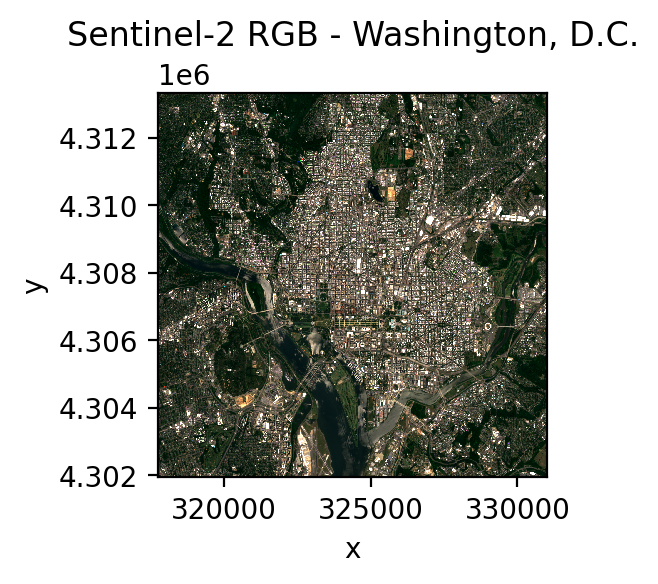

.. _web:

Accessing STAC Catalogs
=======================

GeoWombat integrates easy access to Spatial Temporal Asset Catalog (`STAC <https://stacspec.org/en>`_) APIs.
STAC is a standardized way to expose collections of spatial temporal data. Instead of downloading
large files, STAC lets you search for exactly the imagery you need (by location, date, and cloud cover)
and stream it directly into your analysis. For a full list of public STAC APIs, refer to the
`STAC datasets page <https://stacspec.org/en/about/datasets/>`_.

Installation
------------

To install ``geowombat`` with STAC functionality::

    pip install "geowombat[stac]"

This installs the required dependencies: ``pystac``, ``pystac_client``, ``stackstac``,
and ``planetary_computer``.

Supported catalogs and collections
----------------------------------

:func:`geowombat.core.stac.open_stac` supports the following STAC catalogs:

.. list-table::
   :header-rows: 1
   :widths: 25 75

   * - Catalog
     - Collections
   * - ``element84_v0``
     - ``sentinel_s2_l2a_cogs``
   * - ``element84_v1``
     - ``cop_dem_glo_30``, ``landsat_c2_l2``, ``sentinel_s2_l2a``, ``sentinel_s2_l1c``, ``sentinel_s1_l1c``, ``naip``
   * - ``microsoft_v1``
     - ``cop_dem_glo_30``, ``landsat_c2_l1``, ``landsat_c2_l2``, ``landsat_l8_c2_l2``, ``sentinel_s2_l2a``, ``sentinel_s1_l1c``, ``io_lulc``, ``usda_cdl``, ``esa_worldcover``
   * - ``nasa_lp_cloud``
     - ``hls_l30`` (HLS Landsat 30m), ``hls_s30`` (HLS Sentinel-2 30m)

STAC examples
-------------

Stream Sentinel-2 data from Element 84
~~~~~~~~~~~~~~~~~~~~~~~~~~~~~~~~~~~~~~~

The following example streams Sentinel-2 Level 2A (surface reflectance) bands for
the Washington, D.C. area using `Element 84's <https://www.element84.com/>`_ STAC catalog.

.. code:: python

    from geowombat.core.stac import open_stac

    data, df = open_stac(
        stac_catalog="element84_v1",
        bounds=(-77.1, 38.85, -76.95, 38.95),  # DC area (left, bottom, right, top)
        epsg=32618,  # UTM Zone 18N
        collection="sentinel_s2_l2a",  # Sentinel-2 Level 2A (surface reflectance)
        bands=["blue", "green", "red", "nir"],
        cloud_cover_perc=20,
        start_date="2023-06-01",
        end_date="2023-07-31",
        resolution=10.0,
        chunksize=512,
    )

    # data is a lazy dask-backed xarray DataArray with dims (time, band, y, x)
    print(data)

Plot the results:

.. code:: python

    import matplotlib.pyplot as plt

    fig, ax = plt.subplots(dpi=200, figsize=(3, 3))
    data.sel(time=data.time[0], band=["red", "green", "blue"]).plot.imshow(
        robust=True, ax=ax
    )
    ax.set_title("Sentinel-2 RGB - Washington, D.C.")
    plt.tight_layout(pad=1)

Stream Landsat data from Microsoft Planetary Computer
~~~~~~~~~~~~~~~~~~~~~~~~~~~~~~~~~~~~~~~~~~~~~~~~~~~~~

.. code:: python

    from geowombat.core.stac import open_stac

    data_l, df_l = open_stac(
        stac_catalog='microsoft_v1',
        collection='landsat_c2_l2',
        bounds=(-77.1, 38.85, -76.95, 38.95),
        epsg=32618,
        bands=['red', 'green', 'blue'],
        start_date='2023-06-01',
        end_date='2023-07-31',
        resolution=30.0,
        chunksize=512,
        max_items=5,
    )

    print(data_l)

.. code:: python

    fig, ax = plt.subplots(dpi=200, figsize=(3, 3))
    data_l.sel(time=data_l.time[0]).plot.imshow(
        robust=True, ax=ax
    )
    ax.set_title("Landsat RGB - Washington, D.C.")
    plt.tight_layout(pad=1)

Stream Harmonized Landsat Sentinel-2 (HLS) data from NASA
~~~~~~~~~~~~~~~~~~~~~~~~~~~~~~~~~~~~~~~~~~~~~~~~~~~~~~~~~~

`HLS <https://lpdaac.usgs.gov/data/get-started-data/collection-overview/missions/harmonized-landsat-sentinel-2-hls-overview/>`_
is a NASA product that provides BRDF-normalized surface reflectance from both
Landsat OLI and Sentinel-2 MSI, resampled to a common 30m MGRS grid. This makes
it straightforward to combine observations from both sensors into a single
analysis-ready time series.

Two collections are available via the ``nasa_lp_cloud`` catalog:

- **``hls_l30``** — Landsat OLI (30m, ~8-day revisit)
- **``hls_s30``** — Sentinel-2 MSI (30m, ~5-day revisit)

You can use friendly band names (``red``, ``green``, ``blue``, ``nir``, etc.)
and GeoWombat automatically translates them to the correct HLS asset keys.

.. list-table:: Common band names
   :header-rows: 1
   :widths: 20 20 20

   * - Name
     - L30 key
     - S30 key
   * - ``blue``
     - B02
     - B02
   * - ``green``
     - B03
     - B03
   * - ``red``
     - B04
     - B04
   * - ``nir``
     - B05
     - B8A
   * - ``swir1``
     - B06
     - B11
   * - ``swir2``
     - B07
     - B12

**Authentication**: HLS requires a free `NASA Earthdata <https://urs.earthdata.nasa.gov/users/new>`_
account. Create a ``~/.netrc`` file with your credentials::

    machine urs.earthdata.nasa.gov
    login <your_username>
    password <your_password>

Then set file permissions:

- Linux/macOS: ``chmod 600 ~/.netrc``
- Windows: ``icacls %USERPROFILE%\.netrc /inheritance:r /grant:r %USERNAME%:R``

.. code:: python

    from geowombat.core.stac import open_stac

    # HLS Landsat 30m
    data_l30, df = open_stac(
        stac_catalog="nasa_lp_cloud",
        collection="hls_l30",
        bounds=(-77.1, 38.85, -76.95, 38.95),
        epsg=32618,
        bands=["red", "green", "blue", "nir"],
        start_date="2023-06-01",
        end_date="2023-06-30",
        resolution=30.0,
        max_items=5,
    )

    # HLS Sentinel-2 30m
    data_s30, df = open_stac(
        stac_catalog="nasa_lp_cloud",
        collection="hls_s30",
        bounds=(-77.1, 38.85, -76.95, 38.95),
        epsg=32618,
        bands=["red", "green", "blue", "nir"],
        start_date="2023-06-01",
        end_date="2023-06-30",
        resolution=30.0,
        max_items=5,
    )

.. tip::

    Use ``collection='hls'`` with :func:`~geowombat.core.stac.composite_stac`
    to combine observations from both L30 and S30 into a single cloud-free
    composite. Only bands common to both sensors are allowed (``blue``,
    ``green``, ``red``, ``nir``, ``swir1``, ``swir2``, ``coastal``,
    ``cirrus``). See the `Monthly composites`_ section below.

Cloud masking
~~~~~~~~~~~~~

Set ``mask_data=True`` to automatically mask bad pixels. The appropriate
QA band is auto-injected — you do **not** need to include ``qa_pixel``
or ``scl`` in your ``bands`` list.

- **Sentinel-2**: Loads the SCL (Scene Classification Layer) band and
  masks clouds, cloud shadows, cirrus, saturated/defective pixels, and
  nodata. Default mask classes: ``no_data``, ``saturated_defective``,
  ``cloud_shadow``, ``cloud_medium_prob``, ``cloud_high_prob``,
  ``thin_cirrus``.
- **Landsat**: Loads the ``qa_pixel`` band and applies a bitmask for
  fill, dilated cloud, cirrus, cloud, cloud shadow, and snow.
- **HLS**: Loads the ``Fmask`` band and applies a bitmask for
  cirrus, cloud, adjacent cloud, cloud shadow, and snow/ice.
  Default mask classes: ``cirrus``, ``cloud``, ``adjacent_cloud``,
  ``cloud_shadow``, ``snow_ice``.

.. code:: python

    # Sentinel-2 with cloud masking
    data_s2, df = open_stac(
        stac_catalog="element84_v1",
        collection="sentinel_s2_l2a",
        bounds=(-77.1, 38.85, -76.95, 38.95),
        epsg=32618,
        bands=["blue", "green", "red", "nir"],
        start_date="2023-06-01",
        end_date="2023-07-31",
        cloud_cover_perc=50,
        resolution=100.0,
        max_items=5,
        mask_data=True,  # <-- auto-loads SCL, masks clouds
    )

    # Landsat with cloud masking
    data_ls, df = open_stac(
        stac_catalog="microsoft_v1",
        collection="landsat_c2_l2",
        bounds=(-77.1, 38.85, -76.95, 38.95),
        epsg=32618,
        bands=["red", "green", "blue"],
        start_date="2023-06-01",
        end_date="2023-07-31",
        cloud_cover_perc=50,
        resolution=100.0,
        max_items=5,
        mask_data=True,  # <-- auto-loads qa_pixel, masks clouds
    )

    # HLS with cloud masking
    data_hls, df = open_stac(
        stac_catalog="nasa_lp_cloud",
        collection="hls_l30",
        bounds=(-77.1, 38.85, -76.95, 38.95),
        epsg=32618,
        bands=["red", "green", "blue"],
        start_date="2023-06-01",
        end_date="2023-07-31",
        resolution=30.0,
        max_items=5,
        mask_data=True,  # <-- auto-loads Fmask, masks clouds
    )

You can customize which classes are masked with the ``mask_items``
parameter:

.. code:: python

    # Only mask clouds and cloud shadow for Sentinel-2
    data, df = open_stac(
        ...,
        collection="sentinel_s2_l2a",
        mask_data=True,
        mask_items=["cloud_shadow", "cloud_high_prob"],
    )

    # Only mask clouds and fill for Landsat
    data, df = open_stac(
        ...,
        collection="landsat_c2_l2",
        mask_data=True,
        mask_items=["fill", "cloud", "cloud_shadow"],
    )

    # Only mask clouds for HLS
    data, df = open_stac(
        ...,
        stac_catalog="nasa_lp_cloud",
        collection="hls_l30",
        mask_data=True,
        mask_items=["cloud", "cloud_shadow"],
    )

Temporal composites
~~~~~~~~~~~~~~~~~~~

Use :func:`geowombat.core.stac.composite_stac` to create cloud-free
temporal composites. It wraps ``open_stac()`` with automatic cloud
masking and temporal aggregation:

.. code:: python

    from geowombat.core.stac import composite_stac

    # Monthly Sentinel-2 composite (median, the default)
    comp_s2, df = composite_stac(
        stac_catalog="element84_v1",
        collection="sentinel_s2_l2a",
        bounds=(-77.1, 38.85, -76.95, 38.95),
        epsg=32618,
        bands=["blue", "green", "red", "nir"],
        start_date="2023-06-01",
        end_date="2023-08-31",
        cloud_cover_perc=50,
        resolution=100.0,
        max_items=20,
        frequency="MS",  # Monthly (default)
    )

    print(comp_s2.shape)  # (time=3, band=4, y, x) — one per month

Temporal frequency
^^^^^^^^^^^^^^^^^^

The ``frequency`` parameter accepts any `pandas offset alias
<https://pandas.pydata.org/docs/user_guide/timeseries.html#offset-aliases>`_.
Common values:

.. list-table::
   :header-rows: 1
   :widths: 15 40

   * - Alias
     - Description
   * - ``'D'``
     - Daily
   * - ``'W'``
     - Weekly
   * - ``'2W'``
     - Biweekly (every 2 weeks)
   * - ``'MS'``
     - Monthly — month start (default)
   * - ``'QS'``
     - Quarterly — quarter start
   * - ``'YS'``
     - Yearly — year start

Multiplied forms are supported: ``'15D'`` (every 15 days),
``'2MS'`` (every 2 months), etc.

Aggregation method
^^^^^^^^^^^^^^^^^^

The ``agg`` parameter controls how observations within each time
period are combined. Default is ``'median'``.

.. list-table::
   :header-rows: 1
   :widths: 15 40

   * - Value
     - Description
   * - ``'median'``
     - Median (default) — robust to outliers
   * - ``'mean'``
     - Mean — sensitive to outliers
   * - ``'min'``
     - Minimum value per pixel
   * - ``'max'``
     - Maximum value per pixel

.. code:: python

    # Biweekly mean composite
    comp, df = composite_stac(
        collection="sentinel_s2_l2a",
        bounds=(-77.1, 38.85, -76.95, 38.95),
        epsg=32618,
        bands=["blue", "green", "red", "nir"],
        start_date="2023-06-01",
        end_date="2023-08-31",
        resolution=10.0,
        frequency="2W",
        agg="mean",
    )

.. code:: python

    # Quarterly Landsat composite
    comp_ls, df = composite_stac(
        stac_catalog="microsoft_v1",
        collection="landsat_c2_l2",
        bounds=(-77.1, 38.85, -76.95, 38.95),
        epsg=32618,
        bands=["red", "green", "blue"],
        start_date="2023-01-01",
        end_date="2023-12-31",
        cloud_cover_perc=30,
        resolution=30.0,
        frequency="QS",
    )

.. code:: python

    # Combined HLS (Landsat + Sentinel-2) monthly composite
    comp_hls, df = composite_stac(
        collection="hls",  # queries both hls_l30 and hls_s30
        bounds=(-77.1, 38.85, -76.95, 38.95),
        epsg=32618,
        bands=["blue", "green", "red", "nir"],
        start_date="2023-06-01",
        end_date="2023-08-31",
        resolution=30.0,
        frequency="MS",
        max_items=20,
    )

    print(comp_hls.shape)  # more observations per period from two sensors

.. note::

    Composites preserve all spatial attributes (``crs``, ``res``,
    ``transform``) so you can save directly with ``gw.save()``.
    Time periods where all pixels are cloudy are automatically
    dropped from the output.

Merge multiple collections
~~~~~~~~~~~~~~~~~~~~~~~~~~

Use :func:`geowombat.core.stac.merge_stac` to combine data from different sensors
into a single time series:

.. code:: python

    from geowombat.core.stac import open_stac, merge_stac
    from rasterio.enums import Resampling

    # Load Landsat
    data_l, df_l = open_stac(
        stac_catalog="microsoft_v1",
        collection="landsat_c2_l2",
        bounds=(-77.1, 38.85, -76.95, 38.95),
        bands=["red", "green", "blue"],
        mask_data=True,
        start_date="2023-01-01",
        end_date="2023-12-31",
        epsg=32618,
        resolution=30.0,
    )

    # Load Sentinel-2, reprojected to match Landsat
    data_s2, df_s2 = open_stac(
        stac_catalog="element84_v1",
        collection="sentinel_s2_l2a",
        bounds=(-77.1, 38.85, -76.95, 38.95),
        bands=["blue", "green", "red"],
        resampling=Resampling.cubic,
        epsg=32618,
        start_date="2023-01-01",
        end_date="2023-12-31",
        resolution=30.0,
    )

    # Merge into a single time series
    stack = merge_stac(data_l, data_s2)
    print(stack)

