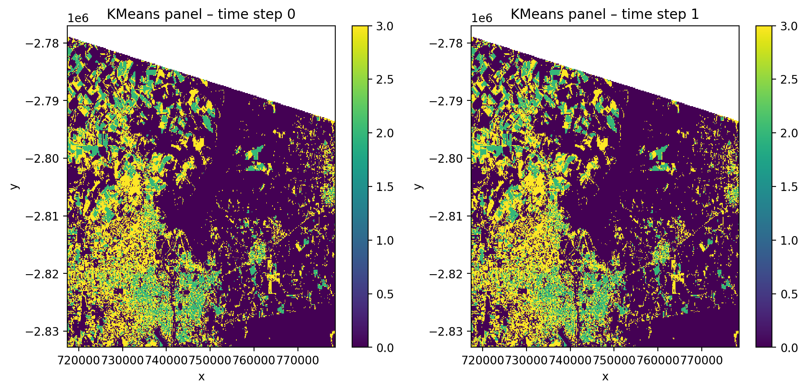

, 
title: 'GeoWombat: Scalable geospatial and remote sensing analysis in Python'
tags:
  - Python
  - remote sensing
  - raster
  - geospatial
  - machine learning
  - deep learning
  - satellite imagery
authors:
  - name: Jordan Graesser
    orcid: 0000-0002-6137-7050
    affiliation: 1
  - name: Michael L. Mann
    orcid: 0000-0002-6268-6867
    affiliation: 2
  - name: Leonardo Hardtke
    affiliation: 3
  - name: Robert Denham
    affiliation: 4
  - name: Sharon Xu
    affiliation: 2
affiliations:
  - name: Indigo Agriculture, Boston, MA, USA
    index: 1
    ror: ""
  - name: Department of Geography, The George Washington University, USA
    index: 2
    ror: 00y4zzh67
  - name: Independent Researcher
    index: 3
  - name: Independent Researcher
    index: 4
date: 7 April 2026
bibliography: paper.bib
, 

# Summary

GeoWombat is an open-source Python library that provides an end-to-end platform for geospatial raster data processing and remote sensing analysis at scale. Built on xarray [@xarray], Dask [@dask], and rasterio [@rasterio_software], GeoWombat simplifies common but complex operations - such as mosaicking multi-tile imagery, reprojecting across coordinate reference systems, aligning rasters of varying resolutions, and performing radiometric corrections - into concise, intuitive commands. The library includes built-in sensor profiles for Landsat 1--8, Sentinel-1 and Sentinel-2, MODIS, and NAIP that automate band naming, scaling, and metadata handling. It supports workflows spanning cloud-based data access via SpatioTemporal Asset Catalogs (STAC) from multiple providers, a full radiometric processing chain (DN-to-reflectance conversion, atmospheric correction, BRDF normalization, and topographic correction), vegetation index computation, raster-vector interoperability, Cython-accelerated moving window statistics, scikit-learn-based [@scikit-learn] machine learning classification, and deep learning with PyTorch [@pytorch]. By leveraging Dask's lazy evaluation and task graphs, GeoWombat enables out-of-core processing of raster datasets of any size on commodity hardware, with optional distributed computing via Ray.

# Statement of need

Satellite remote sensing has become essential for environmental monitoring, agriculture, disaster management, and land use analysis. Modern sensor constellations such as Sentinel-2, Landsat, and PlanetScope produce petabytes of freely available imagery, yet the Python ecosystem for processing this data remains fragmented. A typical analysis workflow requires stitching together multiple libraries, rasterio for I/O, GDAL [@GDAL] for warping, NumPy [@harris2020array] for array math, xarray for labeled dimensions, geopandas [@geopandas] for vector operations, and scikit-learn for modeling, each with its own conventions for handling coordinate reference systems, nodata values, affine transforms, and chunked computation.

Even straightforward tasks such as mosaicking two adjacent Landsat tiles require the analyst to understand affine transformations, coordinate reference system alignment, and resampling strategies. More complex workflows, multi-temporal classification, BRDF-adjusted surface reflectance, or continental-scale time series analysis, demand substantial boilerplate code and deep expertise in the underlying data structures. This complexity creates a barrier for domain scientists (ecologists, agronomists, urban planners) who need to work with satellite imagery but are not geospatial software engineers.

GeoWombat addresses this gap by providing a unified, high-level API that orchestrates these lower-level libraries behind a consistent interface. Its target audience includes GIS professionals, remote sensing scientists, and machine learning practitioners who need to process, analyze, and model large-scale raster data without writing low-level geospatial code.

# State of the field

Several Python packages address parts of the geospatial raster analysis workflow. Rioxarray [@rioxarray] extends xarray with rasterio-backed I/O and CRS-aware operations but does not provide remote sensing-specific functionality such as vegetation indices, QA masking, or classification pipelines. Google Earth Engine [@gorelick2017google] offers cloud-based processing of global archives but requires an internet connection, operates within a proprietary platform, and limits user control over computation. Xee [@xee] bridges Earth Engine with xarray but inherits the same platform constraints. Open Data Cube [@odc] provides a database-indexed approach to analysis-ready data but requires infrastructure setup and data ingestion. Raster Vision [@rv] focuses specifically on deep learning for geospatial imagery and does not cover the broader analysis workflow.

GeoWombat differentiates itself by offering a comprehensive, local-first toolkit that spans the full analysis chain, from data access through modeling, within a single API. Its context manager pattern for on-the-fly reprojection and alignment, built-in sensor profiles for automatic band naming and scaling, and tight integration with scikit-learn pipelines and PyTorch models provide a uniquely cohesive workflow that the above tools do not individually replicate.

# Software design

GeoWombat's architecture centers on three design principles: (1) lazy evaluation for scalability, (2) configuration-driven defaults for usability, and (3) xarray accessor extensibility.

**Lazy evaluation.** All raster operations return Dask-backed xarray DataArrays. Computation is deferred until the user explicitly calls `.compute()` or `.gw.save()`, allowing GeoWombat to build optimized task graphs over arbitrarily large datasets. Chunk sizes are configurable and default to 512 x 512 pixels.

**Configuration context manager.** The `gw.config.update()` context manager sets global parameters, sensor type, reference CRS, spatial resolution, bounding box, and nodata handling, that propagate to all downstream operations:

```python
import geowombat as gw

with gw.config.update(sensor='s2', ref_crs=4326):
    with gw.open(['tile1.tif', 'tile2.tif'],
                 mosaic=True, overlap='mean') as src:
        ndvi = src.gw.ndvi()
        ndvi.gw.save('ndvi_mosaic.tif')
```

**Accessor pattern.** Geospatial methods are attached to xarray DataArrays via the `.gw` accessor (`src.gw.ndvi()`, `src.gw.save()`, `src.gw.extract()`), keeping the namespace clean while providing discoverability.

The library is organized into the following modules:

- **I/O and backends** (`backends/`): Rasterio and GDAL-backed reading and writing with on-the-fly warping and mosaicking. Output is supported in GeoTIFF, NetCDF, VRT, and Zarr formats via `.gw.to_raster()`, `.gw.to_netcdf()`, `.gw.to_vrt()`, and `.gw.to_zarr()`.

- **STAC and cloud data access** (`core/stac.py`): Functions for searching, opening, compositing, and merging imagery from STAC catalogs. Multiple providers are supported including Element84, Microsoft Planetary Computer, and NASA LP CLOUD, with built-in collection definitions for Landsat Collection 2, Sentinel-1 GRD, Sentinel-2 L2A, HLS, NAIP, USDA Cropland Data Layer, and Copernicus DEM.

- **Radiometry** (`radiometry/`): A full radiometric processing chain including digital number to top-of-atmosphere reflectance and surface reflectance conversions, Dark Object Subtraction atmospheric correction, BRDF normalization via the global c-factor method [@ROY2016255], topographic corrections (slope, aspect, and illumination normalization from DEMs), 6S radiative transfer modeling, and Landsat/Sentinel pixel angle extraction. Quality assurance masking decodes sensor-specific bit-packed flags for Landsat, Sentinel-2 Scene Classification, and HLS Fmask.

- **Vegetation indices and band math** (`core/vi.py`): NDVI, EVI, EVI2, AVI, NBR, KNDVI, GCVI, a water index, generic normalized differences, and tasseled cap transformations (brightness, greenness, wetness) with sensor-specific coefficients.

- **Spatial operations** (`core/sops.py`): Point and polygon extraction, random and stratified sampling, subsetting, clipping, masking, value replacement, reclassification (`recode`), area calculation, and sub-pixel co-registration via AROSICS. Coordinate conversion utilities transform between pixel indices, map coordinates, and longitude/latitude. Raster-to-vector and vector-to-raster conversions enable interoperability with geopandas [@geopandas].

- **Moving window statistics** (`moving/`): Cython/OpenMP-accelerated focal operations including mean, standard deviation, and percentile calculations over configurable window sizes.

- **Machine learning** (`ml/`): Integration with scikit-learn pipelines for supervised and unsupervised classification and regression, including `fit()`, `predict()`, and `fit_predict()` workflows with built-in support for spatial cross-validation (\autoref{fig:classification}). Deep learning is supported via PyTorch [@pytorch] with TorchGeo [@torchgeo] integration for architectures including TabNet, Lightweight Temporal Attention Encoder (L-TAE), and segmentation models (UNet, DeepLabV3).

- **Time series analysis** (`core/series.py`): The `gw.series()` interface processes multi-date image stacks with GPU acceleration via JAX [@jax2018github], computing per-pixel temporal statistics including mean, median, amplitude, coefficient of variation, linear slope, percentiles, and quarterly decompositions.

- **Task workflows** (`tasks/`): A directed acyclic graph builder for defining and executing multi-step processing pipelines, with optional distributed execution via Ray.

{ width=90% }

# Research impact

GeoWombat has been used in peer-reviewed research spanning land cover mapping, agricultural monitoring, and environmental change detection. It is actively used in graduate courses at The George Washington University for teaching remote sensing and geospatial machine learning. The library's documentation includes tutorials covering all major features, and it is installable via pip and conda-forge, with over 50,000 downloads. The project maintains continuous integration testing across Python 3.10--3.12 on Linux, and welcomes contributions via its GitHub repository at [https://github.com/jgrss/geowombat](https://github.com/jgrss/geowombat).


# Acknowledgements

We thank all contributors to the GeoWombat project, including Leonardo Hardtke, Robert Denham, and Sharon Xu. This project was not financially supported by any grant funding.

# References
