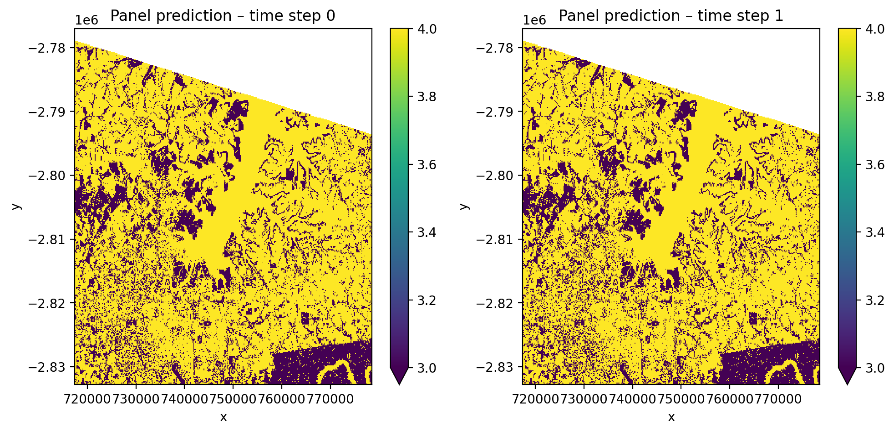

# Summary

GeoWombat is an open-source Python library that provides an end-to-end platform for geospatial raster data processing and remote sensing workflows. Built on xarray [@xarray], Dask [@dask], and rasterio [@rasterio_software], GeoWombat simplifies common but complex operations such as mosaicking multi-tile imagery, on-the-fly reprojection and co-registration, cloud-optimized and STAC-based data access, vegetation index computation, radiometric corrections, and scalable machine learning classification and prediction. By abstracting away the intricacies of coordinate reference systems, affine transformations, and chunked parallel computation, GeoWombat enables researchers to work with satellite imagery from sensors including Landsat, Sentinel-2, and PlanetScope using concise, intuitive code that scales from a laptop to continental-level analyses.

# Statement of need

Satellite remote sensing has become an essential tool for environmental monitoring, agriculture, disaster management, and land use science. Modern archives such as the Landsat and Sentinel programs produce petabytes of freely available imagery, yet the barrier to using these data remains high. Even straightforward tasks---aligning images from different tiles and dates to a common grid, handling varying projections and resolutions, or masking clouds using sensor-specific quality flags---require detailed knowledge of geospatial data structures and sensor metadata.

Python has emerged as the leading language for scientific remote sensing analysis [@srinath2017python], with foundational libraries such as NumPy [@harris2020array], rasterio [@rasterio_software], xarray [@xarray], and Dask [@dask] providing the building blocks. However, composing these libraries into a correct, scalable workflow still demands significant boilerplate code and domain expertise. GeoWombat fills this gap by providing a high-level API that chains these libraries together, allowing users to express multi-step remote sensing workflows---from data ingestion through analysis to output---in a few lines of code while transparently leveraging Dask's task graphs for out-of-core parallel computation.

GeoWombat is designed for GIS professionals, remote sensing scientists, and machine learning practitioners who need to process, analyze, and visualize large-scale raster data. It has been used in university courses, government research projects, and industry applications for land cover mapping and environmental monitoring.

# State of the field

Several Python packages address parts of the geospatial raster processing pipeline. Rioxarray [@rioxarray] extends xarray with rasterio-backed coordinate reference system handling and I/O but does not provide higher-level remote sensing operations such as vegetation indices, classification, or sensor-specific metadata handling. Google Earth Engine [@gorelick2017google] offers cloud-based processing of large archives but requires network access, uses a proprietary API, and does not integrate with the local Python scientific stack. The Open Data Cube [@odc] framework manages analysis-ready data but is oriented toward data management infrastructure rather than interactive analysis. Orfeo ToolBox [@otb] provides extensive image processing algorithms primarily through a C++ backend with Python bindings but does not follow the xarray/Dask ecosystem conventions.

GeoWombat differentiates itself by operating entirely within the local Python scientific ecosystem (xarray, Dask, scikit-learn, PyTorch) while providing sensor-aware convenience methods that eliminate common boilerplate. Its context manager pattern for configuration and I/O, lazy evaluation through Dask, and integration with scikit-learn pipelines and deep learning frameworks make it uniquely suited for researchers who need both interactive exploration and scalable batch processing in a single tool.

# Software design

GeoWombat is organized around three design principles: (1) a configuration-driven context manager pattern, (2) lazy evaluation via Dask, and (3) extension of xarray through a custom accessor.

**Configuration and I/O.** The `gw.config.update()` context manager sets global parameters---sensor type, target CRS, spatial resolution, bounding box, and nodata handling---that propagate through all subsequent operations. The `gw.open()` context manager reads one or more raster files, automatically warping and aligning them to the configured reference grid. Mosaicking, stacking, and band selection are handled at open time:

```python
import geowombat as gw

with gw.config.update(sensor='l8', ref_crs=32621):
    with gw.open([tile_a, tile_b], mosaic=True) as src:
        ndvi = src.gw.ndvi()
        ndvi.gw.save('ndvi_mosaic.tif')
```

**Lazy evaluation.** All operations return Dask-backed xarray DataArrays. Computation is deferred until explicitly triggered by `.compute()` or `.gw.save()`, allowing GeoWombat to build optimized task graphs over rasters of arbitrary size using configurable chunk sizes.

**Accessor pattern.** Geospatial methods are accessed through the `.gw` xarray accessor, providing vegetation indices (NDVI, EVI, NBR, tasseled cap), spatial operations (extraction, masking, clipping), radiometric corrections (BRDF normalization via the c-factor method [@ROY2016255], QA-based cloud masking for HLS, Landsat, and Sentinel), and machine learning workflows. The machine learning module integrates directly with scikit-learn pipelines, enabling users to train, cross-validate, and predict land cover maps in a few lines of code (\autoref{fig:classification}). Deep learning support is provided through PyTorch [@pytorch] with integration for architectures including TabNet and Lightweight Temporal Attention Encoder (L-TAE) via TorchGeo [@torchgeo].

{ width=90% }

**Moving window operations.** Computationally intensive focal statistics are implemented in Cython with OpenMP parallelization, supporting mean, standard deviation, and percentile calculations over configurable window sizes.

**GPU-accelerated time series.** The `gw.series()` interface provides pixel-level time series analysis using JAX [@jax2018github] for GPU acceleration, enabling efficient computation of temporal statistics across large image stacks.

# Research impact statement

GeoWombat is actively used in academic research and education. The library is integrated into remote sensing courses at The George Washington University, where it is used to teach geospatial data science workflows. GeoWombat's documentation, hosted at [geowombat.readthedocs.io](https://geowombat.readthedocs.io), includes tutorials, worked examples, and API references covering all major features. The project maintains continuous integration testing across its core modules and is distributed via PyPI and conda-forge under the MIT license. As of 2026, the repository has accumulated contributions from multiple developers and is used in projects spanning land cover mapping, agricultural monitoring, and environmental change detection.

# AI usage disclosure

Generative AI (Claude, Anthropic) was used to assist in drafting and formatting this paper. All content was reviewed and edited by the authors. No generative AI was used in the development of the GeoWombat software itself.

# Acknowledgements

We thank all contributors to the GeoWombat project. The development of GeoWombat builds on the work of the rasterio, xarray, Dask, scikit-learn, and PyTorch communities.

# References
